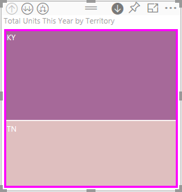
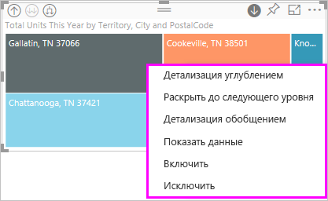
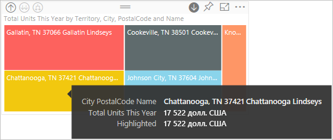

# Режим детализации в визуализации в Power BI

В этой статье демонстрируется детализация в визуализации в службе Microsoft Power BI и Power BI Desktop. В отчетах Power BI несколько иерархий данных позволяют вам получить всю информацию о ваших данных. Выполняя детализацию углублением и обобщением в точках данных, вы можете просматривать подробные сведения о данных. Вы можете воспользоваться преимуществом этого, даже несмотря на небольшой форм-фактор ваших мобильных устройств.

## Детализация с использованием иерархии

Если визуализация имеет иерархию, вы можете выполнить детализацию, чтобы отобразить дополнительные сведения. Например, вы можете создать визуализацию, которая отслеживает количество олимпийских медалей, с иерархией, состоящей из категорий "Спорт", "Дисциплина" и "Событие". По умолчанию в визуализации количество медалей будет отображаться по спортивным дисциплинам, таким как гимнастика, лыжный спорт, водные виды спорта и т. д. Но так как она имеет иерархию, после выбора одного из элементов визуализации (например, линейчатой диаграммы, графика или пузырьковой диаграммы) отобразятся более подробные данные. Выберите элемент **Водные виды спорта**, чтобы просмотреть данные по плаванию, прыжкам в воду и водному поло.  Затем выберите элемент **Прыжки в воду**, чтобы просмотреть данные по прыжкам с трамплина, прыжкам в воду и синхронным прыжкам в воду.

Вы можете добавлять иерархию только в собственные отчеты, но не в совместно используемые.
Не уверены, какая визуализация Power BI содержит иерархию? Наведите указатель мыши на визуализацию. Если в верхнем углу появятся элементы управления детализацией, показанные ниже, значит визуализация имеет иерархию.

    
   

Даты — это уникальный тип иерархии. При добавлении поля даты в визуализацию Power BI автоматически добавляет иерархию времени, которая включает в себя год, квартал, месяц и день. Дополнительные сведения см. в статье об [иерархиях и детализации визуальных элементов](../guided-learning/visualizations.yml?tutorial-step=18) или посмотрите видеоролик ниже.

<iframe width="560" height="315" src="https://www.youtube.com/embed/MNAaHw4PxzE?list=PL1N57mwBHtN0JFoKSR0n-tBkUJHeMP2cP" frameborder="0" allowfullscreen></iframe>

> [!NOTE]
> Чтобы узнать, как создать иерархии с помощью Power BI Desktop, просмотрите видеоролик, посвященный [созданию и добавлению иерархий](https://youtu.be/q8WDUAiTGeU).

## Предварительные требования

1. В службе Power BI или приложении Power BI Desktop для детализации требуется визуализация с иерархией.

1. Чтобы продолжить работу, откройте [пример "Анализ розничной торговли"](../sample-datasets.md). Создайте визуализацию **Диаграмма "дерево"** для просмотра:

    | Область | Поле |
    | ---- | ----- |
    | Значение |Продажи \|\_ Всего единиц за этот год |
    | Группа | Магазин \|\_ Территория \|\_ Город \|\_ Почтовый индекс \|\_ Имя

    Иерархия диаграммы "дерево" состоит из категорий "Территория", "Город", "Почтовый индекс" и "Название города". Каждая территория состоит из одного или нескольких городов, каждый город имеет один или несколько почтовых индексов и т. д. По умолчанию в визуализации отображаются только данные о территории, так как категория *Территория* стоит первой в списке.

    

1. Изучить, как различные значки детализации связаны друг с другом, может быть непросто. Давайте отфильтруем диаграмму "дерево" так, чтобы отображались только две территории меньшего размера: **KY** и **TN**. Выберите диаграмму "дерево", в колонке **Фильтры уровня визуальных элементов** разверните раздел **Территория** и выберите элементы **KY** и **TN**.

    

    Теперь на диаграмме отображаются только две территории.

    

## Три способа использования функций детализации

Есть несколько способов доступа к функциям детализации углублением, детализации обобщением и развертывания для визуализаций с иерархиями. Они описываются ниже. Ознакомившись с основными принципами детализации и развертывания, вы будете знать, как использовать все три. Все они имеют один и тот же результат. Опробуйте их и выберите понравившийся.

- Наведите указатель мыши на визуализацию, чтобы отобразились значки.  

    

- Щелкните визуализацию правой кнопкой мыши, чтобы открыть меню.

    

- В строке меню Power BI нажмите кнопку **Исследовать**.

   

## Пути детализации

### Детализация углублением

Детализировать визуализацию можно несколькими способами. При **детализации углублением** вы переходите к следующему уровню в иерархии. С уровня **Территория** можно перейти на уровень города, затем на уровень почтового индекса и, наконец, на уровень названия. На каждом этапе отображаются новые сведения.

### Развернуть

При **развертывании** к текущему представлению добавляется дополнительный уровень иерархии. Например, на уровне **Территория** можно развернуть диаграмму "дерево" и добавить в нее сведения о городе, почтовом индексе и названии. На каждом последующем этапе отображаются те же сведения, что и на предыдущем, с добавлением одного нового уровня.

Кроме того, можно выбрать, должна ли детализация или развертывание выполняться по одному полю или по всем полям одновременно.

## Детализация по всем полям одновременно

1. Начните с верхнего уровня диаграммы "дерево" с данными по территориям KY и TN. Расширьте диаграмму, выбрав один из маркеров и перетащив его вправо.

    

1. Чтобы перейти к детализации по *всем полям одновременно*, щелкните двойную стрелку в левом верхнем углу визуализации . Теперь на диаграмме "дерево" представлены данные по городам в штатах Кентукки и Теннесси.

    

1. Еще раз перейдите к следующему уровню в иерархии, теперь до почтового индекса.

    

1. Чтобы вернуться на предыдущий уровень детализации, выберите стрелку вверх в левом верхнем углу визуализации. .

## Детализация по одному полю за раз

Этот метод основан на использовании значка детализации, который находится в правом верхнем углу самой визуализации.

1. Чтобы включить детализацию, щелкните значок детализации. .

    Теперь можно выполнять детализацию по **одному полю за раз**.

    

    Если детализация отключена, при выборе элемента визуализации (например, линейчатой, пузырьковой диаграммы или листового узла) детализация не будет выполняться. Вместо этого будет выполняться перекрестная фильтрация других диаграмм на странице отчета.

1. Выберите листовой узел для штата **TN**. Теперь на диаграмме "дерево" приводятся все города в штате Теннесси, в которых есть магазины.

    

1. На данном этапе вы можете сделать следующее:

    1. продолжить выполнять детализацию для Теннесси;

    1. выполнить детализацию для определенного города в штате Теннесси;

    1. вместо этого развернуть все поля (см. сведения в разделе **Развертывание всех полей одновременно** ниже).

    Давайте произведем детализацию по одному полю за раз.  Выберите **Ноксвилл, TN**. Теперь на диаграмме "дерево" приводится почтовый индекс магазина в Ноксвилле.

    

    Обратите внимание, что при выполнении детализации и возвращении на прежний уровень изменяется заголовок.

## Развертывание всех полей и одного поля за раз

Диаграмма "дерево", на которой отображается только почтовый индекс, не очень информативна.  Давайте развернем ее на один уровень вниз в иерархии.  

1. На активной диаграмме "дерево" щелкните значок *развертывания вниз* . Теперь на диаграмме "дерево" отображаются два уровня иерархии: почтовый индекс и название магазина.

    

1. Чтобы увидеть все четыре уровня иерархии данных для штата Теннесси, щелкайте стрелку детализации обобщением, пока не достигнете второго уровня на диаграмме "дерево": **Всего единиц в этом году по территории и городу**.

    

1. Убедитесь, что детализация по-прежнему включена,  и щелкните значок *развертывания вниз* . Теперь на диаграмме "дерево" отображаются дополнительные сведения: помимо города и штата, также отображается почтовый индекс.

    

1. Еще раз щелкните значок *развертывания вниз*, чтобы на диаграмме "дерево" отобразились все четыре уровня иерархии данных для штата Теннесси. Чтобы просмотреть еще более подробные сведения, наведите указатель на листовой узел.

    

## Детализирующие фильтры для других визуальных элементов

В процессе работы в режиме детализации необходимо решить, как детализация углублением и развертывание будут влиять на другие визуализации на странице.

По умолчанию при детализации другие визуальные элементы в отчете не фильтруются. Такую возможность можно включить в приложении Power BI Desktop и службе Power BI.

1. В Power BI Desktop перейдите на вкладку **Формат** и установите флажок **Детализирующие фильтры для других визуализаций**.

    

1. Теперь, когда в визуальном элементе с иерархией выполняется детализация углублением, детализация обобщением или развертывание, фильтруются и другие визуальные элементы на странице.

    

    

> [!NOTE]
> Чтобы включить эту возможность в службе Power BI, в верхней строке меню выберите **Интерактивное взаимодействие** > **Детализирующие фильтры для других визуализаций**.
>
> 

## Основные сведения об оси иерархии и группе иерархии

Ось иерархии и группу иерархии можно считать механизмами, позволяющими повышать и понижать степень детализации данных, которые вы хотите просмотреть. Любые данные, которые можно разбить на категории и подкатегории, считаются имеющими иерархическую структуру, включая даты и время.

Вы можете создать визуализацию с иерархией в Power BI, выбрав одно или несколько полей данных, добавляемых в область **Ось** или **Группа**. Затем добавьте данные, которые необходимо просматривать как поля данных в области **Значения**. Вы узнаете, имеют ли ваши данные иерархическую структуру, по тому, появляются ли значки *режима детализации* в верхних левом и правом углах визуализации.

В сущности, целесообразно разбить иерархические данные на два типа.

- Данные о датах и времени. Если существует поле данных с типом данных DateTime, то у вас уже имеются иерархические данные. В Power BI для любого поля данных автоматически создается иерархия. Вы можете проанализировать значения в структуру [DateTime](https://msdn.microsoft.com/library/system.datetime.aspx). Достаточно просто добавить одно поле DateTime в колодец **Ось** или **Группа**.

- Категориальные данные. Если Power BI извлекает ваши данные из коллекций, которые содержат вложенные коллекции, или в них существуют строки данных с общими значениями, то такие данные считаются иерархическими.

Power BI позволяет развертывать данные по одному или по всем подмножествам. Вы можете выполнять детализацию, чтобы просматривать по одному подмножеству на каждом уровне или просмотреть все подмножества одновременно на каждом уровне. Например, можно выполнить детализацию, чтобы увидеть результаты для определенного года, или просмотреть все результаты для каждого года, продвигаясь вниз по иерархии.

Таким же образом можно понижать степень детализации.

В следующих разделах описывается повышение степени детализации от представления наивысшего уровня, представления среднего уровня и представления наинизшего уровня.

### Иерархические данные и данные о времени

В этом примере:

1. Используйте [пример анализа розничной торговли](../sample-datasets.md) и создайте визуализацию в виде гистограммы с накоплением, в которой представлено следующее:

    | Область | Поле |
    | ---- | ----- |
    | Ось | Время \|\_ Месяц |
    | Значения | Продажи \|\_ ОбщийОбъемПродаж |

    Несмотря на то, что поле данных оси — **Month** (Месяц), в колодце **Ось** создается также категория **Year** (Год). Это происходит потому, что Power BI обеспечивает полную структуру DateTime для всех считываемых значений. На верхнем уровне иерархии отображаются данные за год.

    

1. Включите режим детализации и выберите столбец на диаграмме, чтобы перейти на один уровень иерархии вниз. Вы увидите три столбца для данных по доступным кварталам.

1. Затем в верхнем левом значке выберите пункт **Expand all down one level of the hierarchy** (Развернуть все на один уровень иерархии вниз).

1. Затем повторите это действие еще раз, чтобы дойти до самого нижнего уровня иерархии, на котором показываются результаты для каждого месяца.

    

Помимо визуализации, иерархия также отражается в данных, отображаемых для каждого отчета. В правом верхнем углу нажмите кнопку с многоточием (…), а затем выберите **Показать данные**. В следующей таблице показаны результаты с детализацией от одного месяца или всех месяцев:

|Режим развертывания|Год|Квартал|Месяц|День|
| --- |:---:|:---:|:---:|---|
|Однонаправленная|||||
|Все|||||

Обратите внимание, что данные для **квартального** и **годового** отчетов одинаковы. После детализации до уровня, указанного для **значений**, можно увидеть, что отчет для одного месяца становится более конкретным, а отчет для всех месяцев имеет больше данных.

### Данные иерархических категорий

Данные, которые моделируются по коллекциям и вложенным коллекциям, являются иерархическими.

Хорошим примером являются данные о расположении. Рассмотрим таблицу в источнике данных, в столбцах которого указаны страна, регион, город и почтовый индекс. Данные, имеющие одинаковую страну, регион и город, являются иерархическими.

В этом примере:

1. Используйте [пример анализа розничной торговли](../sample-datasets.md). Создайте визуализацию в виде гистограммы с накоплением, в которой представлено следующее:

    | Область | Поле |
    | ---- | ----- |
    | Значение |Продажи \|\_ Всего единиц за этот год |
    | Ось | Магазин \|\_ Территория \|\_ Город — может потребоваться перетащить "Город" из области **Условные обозначения** в область **Ось**. \|\_ Почтовый индекс \|\_ Имя |

    

1. Если режим детализации включен, в верхнем левом углу три раза щелкните значок **Expand all down one level of the hierarchy** (Развернуть все на один уровень иерархии вниз).

    Вы окажетесь на самом низком уровне иерархии, на котором отображаются результаты для территории, города и почтового индекса.

    

Помимо визуализации, иерархия также отражается в данных, отображаемых для каждого отчета. В правом верхнем углу нажмите кнопку с многоточием (…), а затем выберите **Показать данные**. В следующей таблице показаны результаты с детализацией по одной территории или по всем территориям.

| Режим развертывания|Territory|Город|Почтовый индекс|Имя|
| ---|:---:|:---:|:---:|---|
|Однонаправленная|||||
|Все|||||

 По мере детализации можно видеть, как отчет для **одной** территории становится все более конкретным, а в отчете для **всех** территорий отображается все больше данных.

## Рекомендации и ограничения

Если после добавления поля даты в визуализацию иерархия не была создана, это может означать, что это поле не сохранено в качестве даты. Если у вас есть набор данных:

1. Откройте его в представлении *данных* в Power BI Desktop.

1. Выберите столбец, который содержит дату.

1. На вкладке **Моделирование** для параметра **Тип данных** измените значение на **Дата** или **Дата и время**.

Если отчет предоставил вам другой пользователь, свяжитесь с ним и попросите внести изменения.

## Дальнейшие действия

[Визуализации в отчетах Power BI](../visuals/power-bi-report-visualizations.md)

[Отчеты Power BI](end-user-reports.md)

[Power BI — основные понятия](end-user-basic-concepts.md)

Появились дополнительные вопросы? [Ответы на них см. в сообществе Power BI.](http://community.powerbi.com/)
