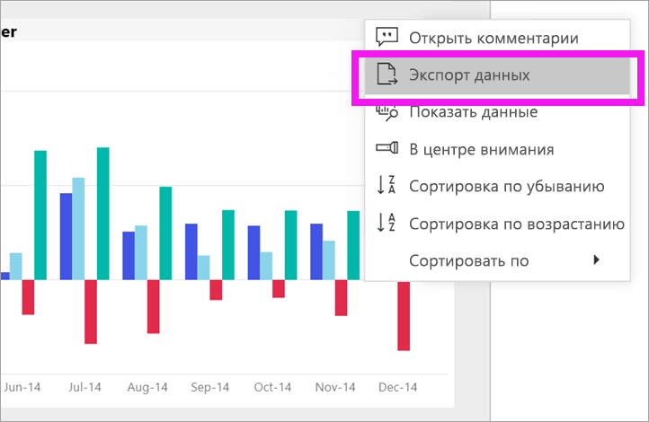

# Экспорт данных из visual
Если вы хотите видеть данные, который используется для создания визуализации, [данные согут отображаться в Power BI](end-user-show-data.md) или экспортировать эти данные в Excel. Параметр, чтобы экспортировать данные требуется тип или лицензии и изменение разрешений для содержимого. Если не удается экспортировать, обратитесь к администратору Power BI. 

## Из визуального элемента на панели мониторинга Power BI

1. Запустите на информационную панель Power BI. Здесь мы используем панели мониторинга из ***маркетинга и продаж образец*** приложения. Вы можете [загрузить это приложение AppSource.com](https://appsource.microsoft.com/en-us/product/power-bi/microsoft-retail-analysis-sample.salesandmarketingsample-preview?flightCodes=e2b06c7a-a438-4d99-9eb6-4324ce87f282).

    

2. Наведите указатель мыши на визуальный элемент, чтобы отобразить кнопку с многоточием (...) и щелкните, чтобы отобразить меню "действие".

    

3. Выберите **Экспорт в Excel**.

4. Что происходит дальше зависит от того, какой именно браузер используется. Может быть предложено сохранить файл или в мае отображается ссылка экспортированного файла в нижней части обозревателя. 

    

5. Откройте файл в Excel.  

    

## Из визуального элемента в отчете
Можно экспортировать данные из визуального элемента в отчет как CSV-файла или .xlsx (Excel) формате. 

1. На панели мониторинга выберите плитку, чтобы открыть соответствующий отчет.  В этом примере мы выбираем тот же визуальный элемент как описано выше, *общее отклонение единицы %* . 

    

    Так как эта Плитка была создана из *продажи и маркетинг — пример* отчет, то есть отчеты, открывающиеся. И он откроется на странице, содержащий выбранную плитку визуального элемента. 

2. Выберите плитку в отчете. Обратите внимание, что **фильтры** панели справа. Этот визуальный элемент имеет фильтры. Дополнительные сведения о фильтрах см. в разделе [использовать фильтры в отчете](end-user-report-filter.md).

    

3. Щелкните многоточие в правом верхнем углу визуализации. Выберите **Экспорт данных**.

    

4. Вы увидите параметры экспорта обобщенные данные или данные базовый. Если вы используете *продажи и маркетинг* приложения, **базовые данные** будет отключена. Однако вы можете столкнуться отчеты, где включены оба параметра. Приводится описание различий.

    **Сводные данные**: выберите этот параметр, если вы хотите экспортировать данные для отображаемые в визуальном элементе.  Этот тип экспорта показано только данные, который использовался для создания визуального элемента. Если визуальный элемент содержит фильтры, данные, экспортированные также будут отфильтрованы. Например эту диаграмму, экспорт будет включать только данные для 2014 и центральном регионе, а только данные для четырех из производителей. VanArsdel, Natura, Aliqui, and Prirum.
  

    **Базовые данные**: выберите этот параметр, если вы хотите экспортировать данные для отображаемые в визуальном элементе **, а также** дополнительные данные из базового набора данных.  Это могут быть данные, содержащиеся в наборе данных, но не используется в визуальном элементе. 

    

5. Что происходит дальше зависит от того, какой именно браузер используется. Может быть предложено сохранить файл или в мае отображается ссылка экспортированного файла в нижней части обозревателя. 

    

7. Откройте файл в Excel. Сравните объем данных, экспортированных данных, экспортированная с одну и ту же визуализацию на панели мониторинга. Отличается тем, что данный экспорт включает **базовые данные**. 

    

