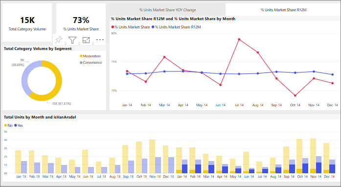

# Перекрестная фильтрация визуальных элементов в отчете Power BI
Одно из главных преимуществ Power BI заключается во взаимосвязи всех визуальных элементов на странице отчета. Когда вы выбираете точку данных на любом из визуальных элементов, с учетом этого изменяется содержимое всех остальных визуальных элементов на странице. 

По умолчанию, выбрав точку данных в одной визуализации на странице отчета будет кросс фильтр, перекрестное выделение и других визуализаций на странице детализации. 

Это может быть полезно для идентификации как одно значение данных участвует в другой. Например выбрав "сегмент" модерации в кольцевой диаграмме представлены вклад из сегмента для каждого столбца в общее количество единиц по диаграмме месяца, и он отфильтровал график справа.

См. раздел [Сведения о фильтрации и выделении](../power-bi-reports-filters-and-highlighting.md). 

Конкретные правила взаимодействия визуальных элементов на странице определяются *конструктором* отчета. Конструкторы могут включать и выключать средства взаимодействия, а также изменять настроенные по умолчанию поведения перекрестной фильтрации, перекрестного выделения и детализации. 
  
> [!NOTE]
> Термины *кроссфильтрация* и *перекрестное выделение* используются для отделения поведения, описанного здесь, от того, что происходит при использовании области **Фильтры** для фильтрации и выделения визуализаций.  

## Рекомендации и устранение неполадок
- Если отчет содержит визуализацию, которая поддерживает [детализации](../power-bi-visualization-drill-down.md), по умолчанию детализация одной визуализации не влияет на другие визуализации на странице отчета.     
- Если вы используете visualA для взаимодействия с visualB, фильтрах уровня визуальных элементов из visualA применяются к visualB.

## Дальнейшие действия
[Использование фильтров отчетов](../power-bi-how-to-report-filter.md)
