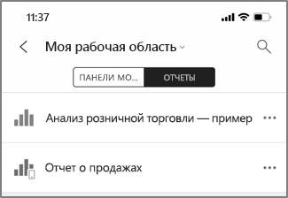
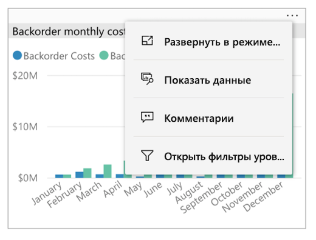

# Просмотр отчетов в мобильных приложениях Power BI
Область применения:

|  |  |  |  |  |
|:--- |:--- |:--- |:--- |:--- |
| iPhone |iPad |Телефоны под управлением Android |Планшеты Android |Устройства под управлением Windows 10 |

Отчет Power BI — это интерактивное представление данных с визуальными элементами, которые отображают различные результаты и сведения, полученные из этих данных. Просмотр отчетов в мобильных приложениях Power BI — это последний шаг трехэтапной процедуры.

1. [Создание отчетов в Power BI Desktop](../../desktop-report-view.md). В Power BI Desktop можно даже [оптимизировать отчет для телефонов](mobile-apps-view-phone-report.md). 
2. Публиковать эти отчеты можно в службе Power BI [(https://powerbi.com)](https://powerbi.com) или на [Сервере отчетов Power BI](../../report-server/get-started.md)).  
3. После этого вы можете работать с отчетами в мобильных приложениях Power BI.

## Открытие отчета Power BI в мобильном приложении
Расположение отчетов Power BI в мобильном приложении зависит от места их получения. Они могут быть в расположении "Приложения", "Мне предоставлен доступ", "Рабочие области" (включая страницу "Моя рабочая область") или на сервере отчетов. Иногда получить отчет можно при помощи связанной панели мониторинга, а иногда они представлены в списке.

В списках и меню вы увидите значок рядом с именем отчета, что поможет понять, что этот элемент является отчетом. 

 

Для отчетов в приложениях Power BI Mobile используются два значка:

*  обозначает отчет, который будет представлен в приложении с альбомной ориентацией и будет выглядеть так же, как и в браузере.

*  обозначает отчет, содержащий по меньшей мере одну страницу отчета, оптимизированного для телефона, которая будет представлена с книжной ориентацией. 

Примечание. Удерживая телефон в альбомной ориентации, вы всегда получите альбомный макет, даже если для страницы отчета есть мобильный макет. 

Чтобы получить отчет из панели мониторинга, коснитесь многоточия (...) в правом верхнем углу плитки и выберите команду **Открыть отчет**.
  
  
  
  Не на всех плитках можно открыть отчет. Например, плитки, созданные после ввода данных в поле вопросов и ответов, не открывают отчеты при касании. 
  
## Взаимодействие с отчетами
После открытия отчета в приложении вы можете начать работу с ним. Существует множество операций, которые можно выполнить с отчетом и его данными. В нижнем колонтитуле отчета находятся действия, которые можно выполнять с ним, а с помощью длительного касания данных, показанных в отчете, можно подробно проанализировать их.

### Использование касания и длительного касания
Касание равноценно щелчку мыши. Если вы хотите осуществить перекрестное выделение отчета по точке данных, коснитесь ее.
При касании значения среза оно выбирается, а также отображает срез остальной части по этому значению. При касании ссылки, кнопка или закладки она активируется образом, предусмотренным автором.

Возможно, вы заметили, что при касании визуального элемента отображается граница. В правом верхнем углу границы находится многоточие (...). Если коснуться его, открывается меню с действиями, которые можно выполнить для этого визуального элемента.

### Подсказки и действия детализации

При длительном касании (нажатии и удерживании) точки данных отображается подсказка, представляющая значения этой точки данных. 

Если автор отчета настроил подсказку для его страницы, она заменит собой подсказку по умолчанию.

> [!NOTE]
> Подсказки отчетов поддерживаются для устройств размером более 640 пикселей с окном просмотра на 320 пикселей. Для устройств меньшего размера приложение использует подсказки по умолчанию.

Авторы отчетов могут определять иерархии в данных и связях между страницами отчета. Иерархия обеспечивает детализацию вверх и вниз, а также детализацию по другой странице отчета из визуального элемента и значения. Таким образом, при длительном касании значения в дополнение к подсказке в нижнем колонтитуле отображаются соответствующие параметры детализации. 

*Детализация* позволяет вам коснуться определенной части визуального элемента в Power BI и перейти на другую страницу отчета, отфильтрованную по выбранному значению.  Автор отчета может задавать различные варианты детализации с переходом на разные страницы. В этом случае вы выбираете из них тот, который вам интересен. Чтобы вернуться на предыдущую страницу отчета, нажмите кнопку "Назад".

Читайте, как [добавить детализацию в Power BI Desktop](../../desktop-drillthrough.md).
   
   > [!IMPORTANT]
   > В приложении Power BI Mobile детализация в матрицах и визуальных элементах таблицы осуществляется только по значению ячейки, а не по заголовкам столбцов и строк.
   
   
   
### Использование действий в нижнем колонтитуле отчета
Нижний колонтитул отчета содержит действия, которые можно выполнить на текущей странице отчета или во всем отчете. Нижний колонтитул обеспечивает быстрый доступ к наиболее полезным действиям, а в меню с многоточием (...) доступны все действия.

Ниже перечислены действия, которые можно выполнить из нижнего колонтитула:
1) Сброс фильтра отчета и перекрестное выделение выбранных элементов обратно в исходное состояние.
2) Открытие области беседы для просмотра или добавления комментариев к этому отчету.
3) Открытие панели фильтра, чтобы просмотреть и изменить примененный к отчету фильтр.
4) Вывод списка всех страниц в этом отчете. Если коснуться имени страницы, загружается и выводится эта страница.
Для перемещения между страницами отчета можно провести от края до центра экрана.
5) Просмотр всех действий с отчетом.

#### Все действия с отчетом
Если коснуться элемента ... в нижнем колонтитуле отчета, выводятся все действия, которые можно выполнить с отчетом. 

Некоторые действия могут быть отключены, так как они зависят от конкретных возможностей отчета.
Например:
1) **Фильтр по текущему расположению** включается, если данные в отчете были классифицированы по автору с географическими данными. [Сведения об определении географических данных в отчете](https://docs.microsoft.com/power-bi/desktop-mobile-geofiltering).
2) **Сканирование для фильтрации отчета по штрихкоду** включается, только если набор данных в отчете помечен как штрихкод. [Сведения о добавлении тегов для штрихкодов в Power BI Desktop](https://docs.microsoft.com/power-bi/desktop-mobile-barcodes). 
3) **Приглашение** включается, только если у вас есть разрешение на предоставление этого отчета другим для общего доступа. Вы будете обладать разрешением, только если являетесь владельцем отчета или получили от владельца разрешение на повторное предоставление для общего доступа.
4) **Добавление заметок и общий доступ** может быть отключено, если в вашей организации действует [политика защиты Intune](https://docs.microsoft.com/intune/app-protection-policies), запрещающая предоставление для общего доступа из приложения Power BI Mobile. 

## Дальнейшие действия
* [Просмотр отчетов Power BI, оптимизированных для телефона, и взаимодействие с ними](mobile-apps-view-phone-report.md)
* [Создание отчетов, оптимизированных для мобильных приложений Power BI](../../desktop-create-phone-report.md)
* У вас появились вопросы? [Попробуйте задать вопрос в сообществе Power BI.](http://community.powerbi.com/)

