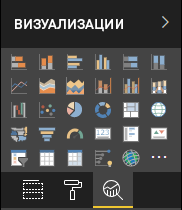

# <a name="analytics-pane-in-power-bi-visuals"></a>Панель аналитики в визуальных элементах Power BI

**Панель аналитики** была [представлена для собственных визуальных элементов](https://docs.microsoft.com/power-bi/desktop-analytics-pane) в ноябре 2018 г.
Пользовательские визуальные элементы с API версии 2.5.0 могут предоставлять свои свойства и управлять ими на **панели аналитики**.



Работа с ней аналогична [управлению свойствами на панели формата](https://docs.microsoft.com/power-bi/developer/custom-visual-develop-tutorial-format-options) и заключается в определении объекта в файле capabilities.json визуального элемента. 

Однако имеются следующие различия:

1. В определении `object` добавьте поле `objectCategory` со значением 2.

    > [!NOTE]
    > `objectCategory` — это необязательное поле, появившееся в API 2.5.0. Оно определяет аспект визуального элемента, контролируемый объектом (1 — "Formatting" (Форматирование), 2 — "Analytics" (Аналитика)). "Formatting" используется для внешнего вида, цветов, осей, меток и т. д. "Analytics" используется для прогнозов, линий тренда, строк ссылок, фигур и т. д.
    >
    > По умолчанию для `objectCategory` используется значение "Formatting", если значение не указано.

2. Объект должен иметь два следующих свойства:
    1. `show` типа bool со значением по умолчанию false.
    2. `displayName` типа text. Выбранное вами значение по умолчанию станет начальным отображаемым именем экземпляра.

```json
{
  "objects": {
    "YourAnalyticsPropertiesCard": {
      "displayName": "Your analytics properties card's name",
      "objectCategory": 2,
      "properties": {
        "show": {
          "type": {
            "bool": true
          }
        },
        "displayName": {
          "type": {
            "text": true
          }
        },
      ... //any other properties for your Analytics card
      }
    }
  ...
  }
}
```

Все другие свойства можно определить так же, как и для объектов форматирования. Перечисление объектов выполняется точно так же, как и на **панели формата**.

***Известные ограничения и проблемы***

  1. Поддержка множественных экземпляров пока отсутствует. Объекты не могут иметь [selector](https://microsoft.github.io/PowerBI-visuals/docs/concepts/objects-and-properties/#selector), отличный от static (то есть "selector": null), а пользовательские визуальные элементы не могут иметь определенные пользователем множественные экземпляры карты.
  2. Свойства типа `integer` отображаются неправильно. Чтобы обойти эту проблему, используйте тип `numeric`.

> [!NOTE]
> Используйте панель аналитики только для объектов, которые добавляют новые сведения или раскрывают новые аспекты представленной информации. Например, динамические строки ссылок, иллюстрирующие важные тренды.
> Все параметры, определяющие внешний вид визуального элемента, например форматирование, должны находиться на панели форматирования.
