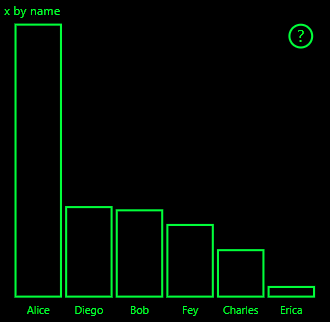

# <a name="high-contrast-mode-support-in-power-bi-visuals"></a>Поддержка режима высокой контрастности для визуальных элементов Power BI

Параметр *Высокая контрастность* Windows упрощает чтение текста и приложений за счет использования более резко выраженных цветов. В этой статье описывается, как добавить поддержку режима высокой контрастности для визуальных элементов Power BI. Дополнительные сведения см. в разделе [Поддержка режима высокой контрастности в Power BI](https://powerbi.microsoft.com/blog/power-bi-desktop-june-2018-feature-summary/#highContrast).

Чтобы просмотреть реализацию поддержки высокой контрастности, перейдите в [репозиторий визуальных элементов PowerBI-visuals-sampleBarChart](https://github.com/Microsoft/PowerBI-visuals-sampleBarChart/commit/61011c82b66ca0d3321868f1d089c65101ca42e6).

## <a name="on-initialization"></a>При инициализации

Член colorPalette объекта `options.host` имеет несколько свойств для режима высокой контрастности. Используйте их, чтобы определить, активен ли режим высокой контрастности, и если активен, какие следует использовать цвета.

### <a name="detect-that-power-bi-is-in-high-contrast-mode"></a>Определение того, что Power BI работает в режиме высокой контрастности

Если параметр `host.colorPalette.isHighContrast` имеет значение `true`, то активен режим высокой контрастности и визуальный элемент должен отрисовываться соответствующим образом.

### <a name="get-high-contrast-colors"></a>Получение цветов режима высокой контрастности

В режиме высокой контрастности визуальный элемент должен ограничивать используемые цвета следующими:

* **Передний план** — этот цвет используется для рисования всех линий, значков, текста, а также контуров или заливки фигур.
* **Фон** — этот цвет используется для фона, а также для заливки выделенных по контуру фигур.
* **Foreground - selected** (Передний план — выбранный) — этот цвет используется для обозначения выбранного или активного элемента.
* **Гиперссылка** — этот цвет используется только для текста гиперссылки.

> [!NOTE]
> Если требуется дополнительный цвет, можно использовать цвет переднего плана с некоторой степенью непрозрачности (в собственных визуальных элементах Power BI используется непрозрачность 40 %). Используйте эту функцию аккуратно, чтобы обеспечить читаемость сведений визуальных элементов.

Во время инициализации вы можете сохранить следующие значения:

```typescript
private isHighContrast: boolean;

private foregroundColor: string;
private backgroundColor: string;
private foregroundSelectedColor: string;
private hyperlinkColor: string;
//...

constructor(options: VisualConstructorOptions) {
    this.host = options.host;
    let colorPalette: ISandboxExtendedColorPalette = host.colorPalette;
    //...
    this.isHighContrast = colorPalette.isHighContrast;
    if (this.isHighContrast) {
        this.foregroundColor = colorPalette.foreground.value;
        this.backgroundColor = colorPalette.background.value;
        this.foregroundSelectedColor = colorPalette.foregroundSelected.value;
        this.hyperlinkColor = colorPalette.hyperlink.value;
    }
```

Можно также сохранить объект `host` во время инициализации и получить доступ к соответствующим свойствам `colorPalette` во время обновления.

## <a name="on-update"></a>При обновлении

Конкретные реализации поддержки высокой контрастности отличаются у разных визуальных элементов и зависят от особенностей графического дизайна. Как правило, для режима высокой контрастности требуется немного иной дизайн, чем для режима по умолчанию, чтобы было легче различить важные детали, представленные ограниченными цветами.

В отношении собственных визуальных элементов Power BI применяются следующие рекомендации:

* Все точки данных используют один и тот же цвет (передний план).
* Текст, оси, стрелки, линии и другие аналогичные элементы используют цвет переднего плана.
* Толстые фигуры рисуются в виде контуров с толстыми линиями (по меньшей мере два пикселя) и заливкой цвета фона.
* Если это применимо, точки данных дифференцируются с помощью маркеров различных форм, а линии данных — с помощью различных штрихов.
* При выделении элемента данных для всех остальных элементов устанавливается непрозрачность 40 %.
* Для срезов в активных элементах фильтра используется цвет, выбранный для переднего плана.

Например, на следующем образце линейчатой диаграммы все линии рисуются толщиной в два пикселя с контуром цвета переднего плана и заливкой цвета фона. Сравните цвета по умолчанию с парой тем высокой контрастности:





В следующем разделе показано изменение в функции `visualTransform`, реализованное для поддержки высокой контрастности. Она вызывается в процессе отрисовки во время обновления.

### <a name="before"></a>До

```typescript
for (let i = 0, len = Math.max(category.values.length, dataValue.values.length); i < len; i++) {
    let defaultColor: Fill = {
        solid: {
            color: colorPalette.getColor(category.values[i] + '').value
        }
    };

    barChartDataPoints.push({
        category: category.values[i] + '',
        value: dataValue.values[i],
        color: getCategoricalObjectValue<Fill>(category, i, 'colorSelector', 'fill', defaultColor).solid.color,
        selectionId: host.createSelectionIdBuilder()
            .withCategory(category, i)
            .createSelectionId()
    });
}
```

### <a name="after"></a>После

```typescript
for (let i = 0, len = Math.max(category.values.length, dataValue.values.length); i < len; i++) {
    const color: string = getColumnColorByIndex(category, i, colorPalette);

    const selectionId: ISelectionId = host.createSelectionIdBuilder()
        .withCategory(category, i)
        .createSelectionId();

    barChartDataPoints.push({
        color,
        strokeColor,
        strokeWidth,
        selectionId,
        value: dataValue.values[i],
        category: `${category.values[i]}`,
    });
}

//...

function getColumnColorByIndex(
    category: DataViewCategoryColumn,
    index: number,
    colorPalette: ISandboxExtendedColorPalette,
): string {
    if (colorPalette.isHighContrast) {
        return colorPalette.background.value;
    }

    const defaultColor: Fill = {
        solid: {
            color: colorPalette.getColor(`${category.values[index]}`).value,
        }
    };

    return getCategoricalObjectValue<Fill>(category, index, 'colorSelector', 'fill', defaultColor).solid.color;
}
```
