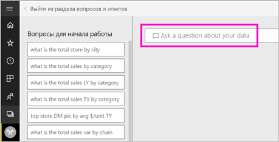
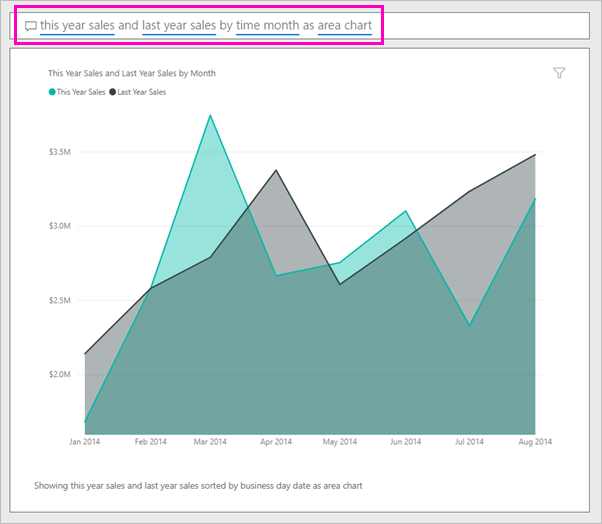

# Создание визуального элемента с помощью Power BI Q & A

Иногда самый быстрый способ получить ответ по данным — задать вопрос, используя естественный язык.  В этой статье мы рассмотрим два разных способа создания одной визуализации: во-первых, ввод вопроса в Q & A, а во-вторых, для его создания в отчете. Мы используем в службе Power BI для создания визуального элемента в отчете, но процесс практически идентичны, с помощью Power BI Desktop.

Для работы с этим руководством нужен отчет, который вы можете изменять. Поэтому будем использовать один из доступных примеров в Power BI.

## Создание визуального элемента с помощью функции вопросов

Как мы можем о создании этого графика, использование вопросов?

1. В рабочей области Power BI выберите **Получить данные** \> **Примеры** \> **Анализ розничной торговли — пример** > **Подключить**.

1. Откройте панель мониторинга примера анализа розничной торговли и поместите курсор в поле вопросов и **задать вопрос о данных**.

    

2. В поле вопросов введите нечто вроде этого вопроса:
   
    **продажи за этот год и продажи за прошлый год по месяцам в виде диаграммы с областями**
   
    По мере ввода вопроса функция "Вопросы и ответы" Power BI выбирает наиболее подходящую визуализацию для отображения ответа; и эта визуализация динамически меняется по мере изменения вопроса. Кроме того, функция помогает отформатировать вопрос, используя предложения, автоматическое завершение и правку орфографии. Q & A рекомендует изменения небольшой текст: «продажи за этот год и продажи за прошлый год по *месяц* виде диаграммы с областями».  

    

4. Выберите предложение, чтобы принять предложение. 
   
   Когда вы закончите вводить вопрос, результатом является одной диаграмме, отобразится на панели мониторинга.
   
   

4. Чтобы закрепить диаграмму на панели мониторинга, выберите значок булавки.  в правом верхнем углу.

## Создание визуального элемента в редакторе отчетов

1. Вернитесь на информационную панель "Анализ розничной торговли — пример".
   
2. Панель мониторинга содержит ту же плитку диаграммы в области «Продажи за прошлый год и продажи за этот год.»  Выберите эту плитку. Не выбирайте плитки, созданной с помощью вопросов и ответов Выбрав его открывает, вопросов и ответов Исходный плитку диаграммы с областями была создана в отчете, поэтому отчет открывается на странице, содержащей эту визуализацию.

    

1. Откройте отчет в режиме редактирования, выбрав пункт **Изменить отчет**.  Не являясь владельцем отчета, вы не сможете открыть отчет в представлении редактирования.
   
    
4. Выберите диаграмму с областями и просмотрите параметры в области **Поля** .  Автор отчета создал эту диаграмму, выбрав эти три значения (**продажи за прошлый год** и **продажи за этот год > значение** из **Sales** таблицы, и  **Отчетный месяц** из **время** таблицы) и организовав их в **оси** и **значения** ячейки.
   
    

    Видно, что получилось ту же визуализацию. Создать ее таким образом не было слишком сложным. Но его создания с помощью вопросов и было гораздо проще!

## Дальнейшие действия

- [Используйте вопросы И ответы в панелях мониторинга и отчеты](power-bi-tutorial-q-and-a.md)  
- [Вопросы И ответы для потребителей](consumer/end-user-q-and-a.md)
- [Настройка данных для работы с функцией "Вопросы и ответы" в Power BI](service-prepare-data-for-q-and-a.md)

Появились дополнительные вопросы? [Ответы на них см. в сообществе Power BI.](http://community.powerbi.com/)

