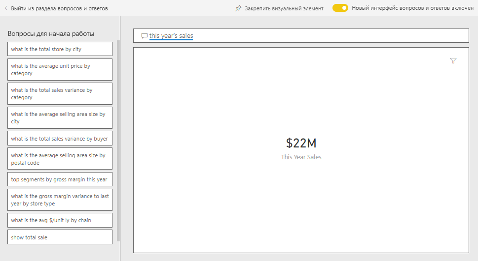
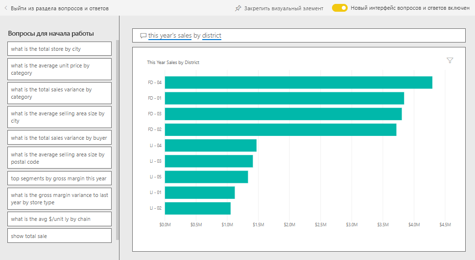
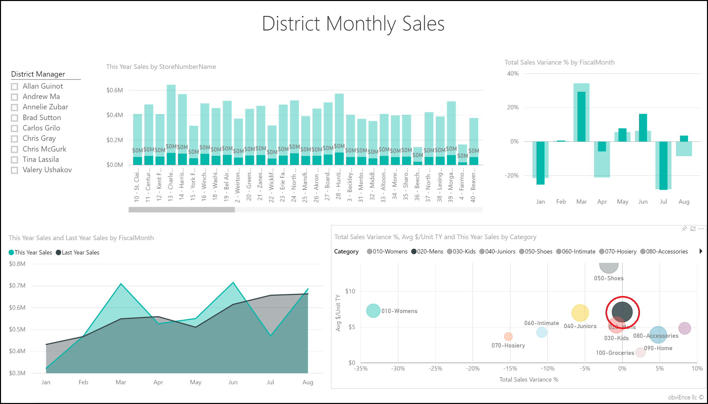
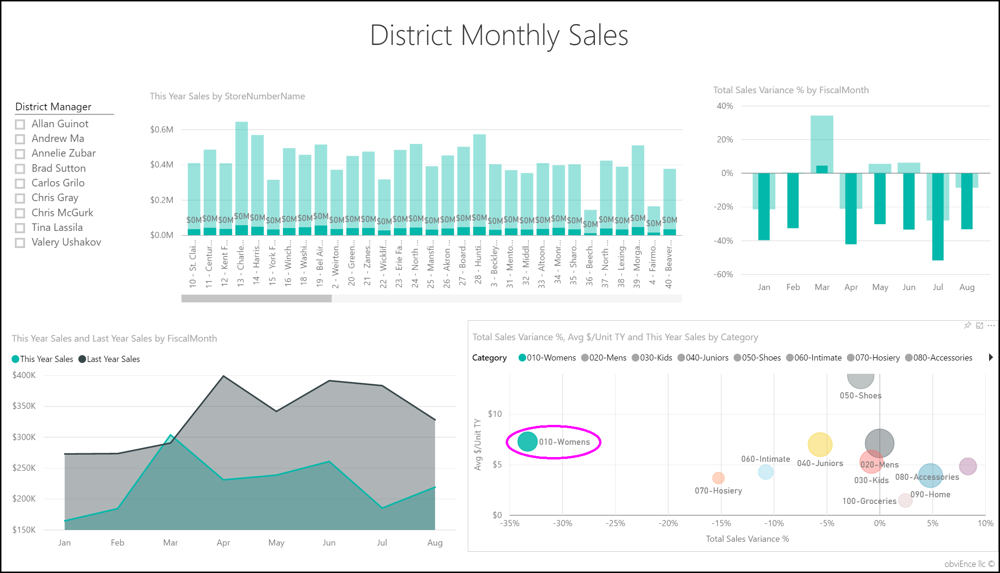
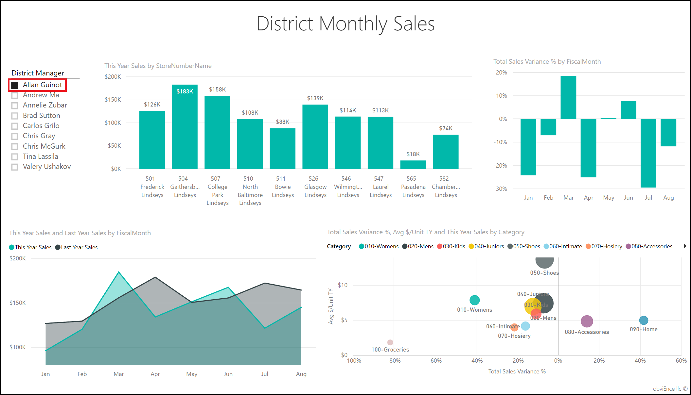

# Пример "Анализ розничной торговли" для Power BI: Узнайте о возможностях

Этот пример "Анализ розничной торговли" содержит панель мониторинга, отчет и набор данных для изучения сведений о розничных продажах товаров по нескольким магазинам и районам. Эффективность деятельности за текущий и прошлый год сравнивается в метриках по продажам, единицам продукции, валовой прибыли, расхождениям, а также анализу новых магазинов. 

Этот пример входит в серию, демонстрирующую, как использовать Power BI с бизнес-данными, отчетами и панелями мониторинга. Он создан на основе реальных данных [obviEnce](http://www.obvience.com/), которые были анонимизированы. Данные доступны в нескольких форматах: пакет содержимого, PBIX-файл Power BI Desktop или книга Excel. См. сведения в статье [Примеры данных, доступные для использования в службе Power BI](sample-datasets.md). 

В этом руководстве описано, как использовать пример пакета содержимого "Анализ розничной торговли" в службе Power BI. Так как в Power BI Desktop и службе возможности работы с отчетами практически не отличаются, этот же пример PBIX-файла можно использовать и в Power BI Desktop. 

Вам не требуется лицензия Power BI для просмотра примеров в Power BI Desktop. Если у вас нет лицензии Power BI Pro, можно сохранить пример в личную рабочую область в службе Power BI. 

## Получение примера

 Прежде чем использовать пример, необходимо скачать его как [пакет содержимого](#get-the-content-pack-for-this-sample), [PBIX-файл](#get-the-pbix-file-for-this-sample) или [книгу Excel](#get-the-excel-workbook-for-this-sample).

### Получение пакета содержимого для этого примера

1. Откройте службу Power BI (app.powerbi.com), войдите в систему и откройте рабочую область, где хотите сохранить пример. 

    Если у вас нет лицензии Power BI Pro, можно сохранить пример в личной рабочей области.

2. В левом нижнем углу выберите **Получить данные**.

    
3. На странице **Получение данных** выберите **Примеры**.
   
4. Выберите **Анализ розничной торговли — пример** и щелкните **Подключиться**.  
  
   
   
5. Power BI импортирует пакет содержимого и добавляет новую панель мониторинга, отчет и набор данных в текущую рабочую область.
   
   
  
### Получение PBIX-файла для этого примера

Кроме того, вы можете загрузить пример "Анализ розничной торговли" в виде [PBIX-файла](http://download.microsoft.com/download/9/6/D/96DDC2FF-2568-491D-AAFA-AFDD6F763AE3/Retail%20Analysis%20Sample%20PBIX.pbix), который предназначен для работы с Power BI Desktop. 

### Получение книги Excel для этого примера

Если вы хотите просмотреть источник данных для этого примера, он также доступен в виде [книги Excel](http://go.microsoft.com/fwlink/?LinkId=529778). Книга содержит листы Power View, которые можно просматривать и изменять. Чтобы просмотреть необработанные данные, включите надстройки анализа данных и выберите **Power Pivot > Управление**. Чтобы включить надстройки Power View и Power Pivot, перейдите к разделу [Просмотр примеров Excel непосредственно из Excel](sample-datasets.md#optional-take-a-look-at-the-excel-samples-from-inside-excel-itself).

## Запуск на панели мониторинга и открытие отчета

1. В рабочей области с примером откройте вкладку **Панель мониторинга** и выберите панель мониторинга **Анализ розничной торговли — пример**. 
2. На этой панели мониторинга откройте вкладку **Всего магазинов — новые и существующие магазины**. Откроется страница **Обзор продаж в магазине** в отчете "Анализ розничной торговли". 

     

   На этой странице отчета вы увидите, что работают 104 магазина, 10 из которых являются новыми. У нас есть две сети: Fashions Direct и Lindseys. В среднем магазины Fashions Direct крупнее.
3. На круговой диаграмме **Продажи за этот год по сетям магазинов** выберите сектор **Fashions Direct**.

     

   Обратите внимание на результат на пузырьковой диаграмме **Общее отклонение продаж, %** .

     

   Район **FD-01** демонстрирует наибольший **средний объем продаж на квадратный метр**, а FD-02 имеет наименьшее **общее отклонение продаж** по сравнению с предыдущим годом. FD-03 и FD-04 имеют наихудшие показатели.
4. Выбирайте отдельные пузырьки или другие диаграммы, чтобы определить влияние выбранных вами параметров
5. На панели навигации вверху выберите пример **Анализ розничной торговли**, чтобы вернуться к панели мониторинга.

   
6. На панели мониторинга выберите плитку **Продажи за этот год — новые и существующие магазины** (аналогично вводу *Продажи за этот год* в поле вопроса).

   

   Отобразятся результаты функции "Вопросы и ответы":

   

## Просмотр плитки, созданной с помощью поля "Вопросы и ответы" Power BI
Давайте запросим более конкретные сведения.

1. Немного измените вопрос: _продажи за этот год **по районам**_ . Просмотрите результаты — Служба автоматически помещает ответ в линейчатую диаграмму и предлагает дополнительные фразы:

   
2. Теперь измените вопрос следующим образом: _продажи за этот год **по почтовому индексу и сети**_ .

   Обратите внимание, как по мере ввода вопроса Power BI изменяет отображение, предлагая подходящую диаграмму.
3. Поэкспериментируйте с другими вопросами и посмотрите, какие результаты можно получить.
4. Когда все будет готово, возвращайтесь к панели мониторинга.

## Подробные сведения о данных
Теперь давайте рассмотрим все более подробно, определив производительность по районам.

1. На этой панели мониторинга выберите плитку **Продажи за этот год, продажи за прошлый год**. Откроется страница **Продажи района по месяцам** выбранного отчета.

   

   Обратите внимание на значительное расхождение с прошлым годом на диаграмме **Суммарное отклонение продаж в % по финансовому месяцу**, где особенно неудачными месяцами являются январь, апрель и июль.

   

   Давайте посмотрим, сможем ли мы выявить источник проблем.
2. На пузырьковой диаграмме щелкните пузырек **020-Mens**.

     

   Обратите внимание, что категория мужских товаров в апреле не характеризуется спадом, как продажи в целом, но январь и июль остались проблемными месяцами.
1. Теперь щелкните пузырек **010-Womens**.

   

   Обратите внимание, что по женским товарам во все месяцы показатели значительно ниже общих по продажам, а также почти всегда ниже аналогичных показателей за предыдущий год.
1. Выберите пузырек еще раз, чтобы очистить фильтр.

## Попробуйте использовать срез
Давайте посмотрим, насколько эффективно осуществляются продажи по районам.

1. Щелкните **Allan Guinot** в срезе **Менеджер округа** вверху слева.

   

   Обратите внимание, что в марте и июне этот район перекрыл показатели прошлого года.
2. Сохраняя выбранным значение **Allan Guinot**, выберите пузырек **Womens-10** на пузырьковой диаграмме.

   

   Обратите внимание, что по категории женских товаров этот район не смог повторить прошлогодний объем продаж.
3. Изучите результаты по другим региональным менеджерам и категориям. Какую дополнительную информацию вы сможете найти?
4. Завершив анализ, возвращайтесь на панель мониторинга.

## Что сообщают данные о росте продаж в этом году
Последней мы изучим такую область данных, как рост путем открытия новых магазинов в этом году.

1. Щелкните плитку **Магазины, открытые в этом году по месяцам открытия и сетям**. Откроется страница **Анализ новых магазинов** в выбранном отчете.

   

   На этой плитке видно, что в этом году открыто больше магазинов Fashions Direct, чем магазинов Lindseys.
2. Просмотрите диаграмму **Продажи на единицу площади по имени**:

   

    Обратите внимание на различия в среднем уровне продаж на единицу площади у новых магазинов.
3. Выберите элемент **Fashions Direct** в легенде к диаграмме **Число открытых магазинов по месяцам открытия и сетям** вверху справа. Обратите внимание, что для одной и той же сети лучший магазин (Winchester Fashions Direct) значительно обходит по показателям худший магазин (Cincinnati 2 Fashions Direct) — 21,22 против 12,86 долл. США соответственно.

   
4. Щелкните **Winchester Fashions Direct** в срезе **Имя** и изучите диаграмму. Первый отчет с суммами продаж поступил в феврале.
5. Щелкните **Cincinnati 2 Fashions Direct** на том же срезе, и вы увидите на графике, что этот магазин был открыт в июне и, похоже, имеет самые низкие показатели.
6. Изучите данные, щелкая другие панели, графики и пузырьки на всех диаграммах, и попробуйте обнаружить ценные сведения.

## Дальнейшие действия: Подключение к данным
В этой среде можно свободно экспериментировать, так как сохранять изменения не требуется. Однако если изменения сохраняются, всегда можно выбрать функцию **Получить данные** для получения новой копии этого примера.

Мы надеемся, что из этого обзора вы узнали, как с помощью панелей мониторинга, вопросов и ответов, а также отчетов Power BI можно получить представление о данных из примера. Теперь ваша очередь — выполните подключение к собственным данным. С помощью Power BI можно подключаться ко многим типам источников данных. Дополнительные сведения см. в руководстве по [началу работы со службой Power BI](service-get-started.md).
