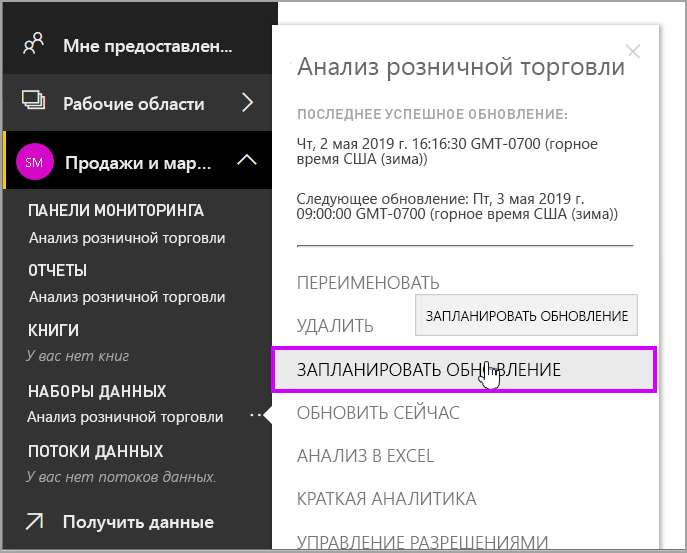
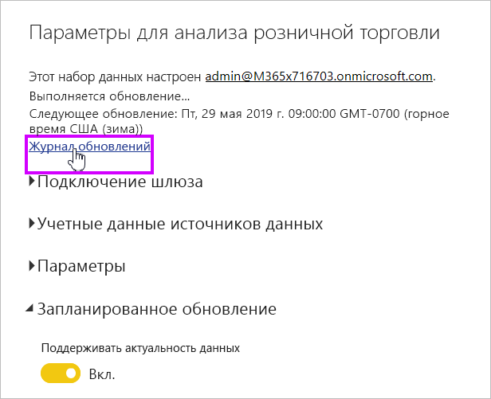
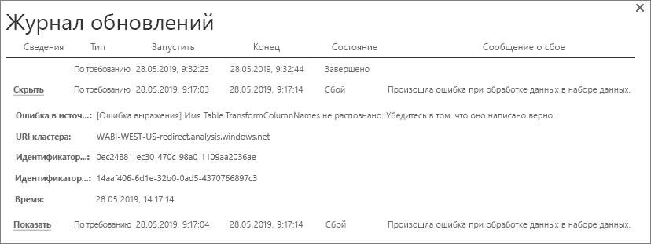
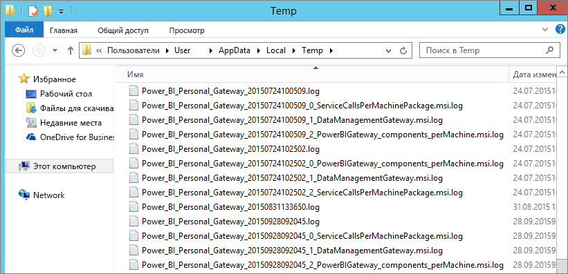

# Устранение неполадок с Power BI Gateway - Personal
В следующих разделах описываются через распространенные проблемы, которые вы можете столкнуться при использовании Power BI Gateway-Personal.

> [!NOTE]
> Текущая версия шлюза для личного использования — **локальный шлюз данных (персональный режим)**. Обновите установку, чтобы использовать эту версию.
> 
> 

## Обновление до самой последней версии
При использовании устаревшей версии шлюза может возникать ряд проблем.  Это общие рекомендуется убедиться, что вы используете последнюю версию. Если шлюз не обновлялся месяц или дольше, рекомендуется установить последнюю версию шлюза. Затем см. в разделе, если можно воспроизвести проблему.

## Установка
**Личный шлюз является 64-разрядная версия** -Если ваш компьютер 32-разрядной, не удается установить личный шлюз. Должен быть 64-разрядной версии операционной системы. Установка 64-разрядной версии Windows или установить личный шлюз на 64-разрядном компьютере.

**Личный шлюз не сможет установить в качестве службы, несмотря на то, что вы являетесь локальным администратором на компьютере** -установка может завершиться ошибкой, если пользователь находится в локальной группе администраторов компьютера, но групповой политики не позволяет конкретному пользователю выполнять вход как Служба. На данный момент убедитесь, что групповая политика позволяет пользователю войти качестве службы. Мы работаем над исправлением этой проблемы. [Дополнительные сведения](https://technet.microsoft.com/library/cc739424.aspx)

**Превышено время ожидания операции** -это сообщение часто происходит, если на компьютере (физическом компьютере или виртуальной Машины), на котором устанавливается личный шлюз установлен одноядерный процессор. Закройте все приложения, отключите все необязательные процессы и попытайтесь повторить установку.

**Шлюз управления данными или Analysis Services Connector нельзя установить на одном компьютере с личным шлюзом** — Если у вас уже есть Analysis Services Connector или шлюз управления данными, сначала необходимо удалить соединитель или шлюз. Затем попробуйте установить личный шлюз.

> [!NOTE]
> Если возникли проблемы во время установки журналы установки могут предоставить сведения, помогающие устранить проблему. Дополнительные сведения см. в разделе [журналы установки](#SetupLogs).
> 
> 

 **Конфигурация прокси-сервера** могут возникнуть проблемы при настройке личного шлюза, если в вашей среде требуется использование прокси-сервера. Дополнительные сведения о настройке прокси-сервера см. в разделе [Настройка параметров прокси-сервера для шлюзов Power BI](service-gateway-proxy.md).

## Расписание обновления
**Ошибка Отсутствуют учетные данные, хранящиеся в облаке.**

Эта ошибка может появиться в параметрах для \<набора данных\> Если вы запланировали обновление и затем удаления и переустановки личный шлюз. При удалении личного шлюза учетные данные источника данных для набора данных, настроенную для обновления удаляются из службы Power BI.

**Решение:** В Power BI перейдите к параметрам обновления для набора данных. В Управление источниками данных для любого источника данных с ошибкой, выберите **изменить учетные данные** и снова войдите источнике данных.

**Ошибка Недопустимые учетные данные для набора данных. Чтобы продолжить работу, обновите учетные данные, используя функцию обновления или диалоговое окно "Параметры источника данных".**

**Решение.** Если вы получите сообщение об учетных данных, это может означать следующее:

* Убедитесь, что имена пользователей и пароли для входа в источники данных находятся в актуальном состоянии. В Power BI перейдите к параметрам обновления для набора данных. В Управление источниками данных, выберите **изменить учетные данные** обновить учетные данные для источника данных.
* Гибридные приложения между облачным источником и локального источника, в одном запросе, не удалось обновить в личном шлюзе, если один из источников с помощью OAuth для проверки подлинности. Пример этой проблемы — привести гибрид между CRM Online и локальный SQL Server. Комбинирование завершается ошибкой, поскольку CRM Online требует OAuth.
  
  Эта ошибка является известной проблемой и разрабатывается в. Чтобы обойти проблему, иметь отдельный запрос для облачного и локального источника. Затем используется режим слияния или добавления Соедините эти запросы.

**Ошибка Неподдерживаемый источник данных.**

**Решение:** Сообщение о неподдерживаемом источнике данных в параметрах расписания обновления может означать следующее: 

* Источник данных сейчас не поддерживается для обновления в Power BI. 
* Книга Excel не содержит модель данных, а только данные листа. Power BI в настоящее время поддерживает обновление, только если переданная книга Excel содержит модель данных. При импорте данных с помощью Power Query в Excel обязательно выберите вариант загрузки данных в модель данных. Этот параметр гарантирует, что данные будут импортированы в модель данных. 

**Ошибка: [Не удается объединить данные] &lt;часть запроса&gt;/&lt;... &gt; / &lt;... &gt; обращается к источникам данных, имеющим уровни конфиденциальности, которые не могут использоваться вместе. Повторите сборку этого объединения данных.**

**Решение.** Эта ошибка возникает из-за ограничения уровня конфиденциальности и типы источников данных, которую вы используете.

**Ошибка Ошибка в источнике данных: не удается преобразовать значение \[таблица\] в тип таблицы.**

**Решение.** Эта ошибка возникает из-за ограничения уровня конфиденциальности и типы источников данных, которую вы используете.

**Ошибка Недостаточно места для этой строки.**

Эта ошибка возникает, если размер одной строки превышает 4 МБ. Найдите строку из источника данных и попытаться отфильтровать ее или уменьшить размер для этой строки.

## Источники данных
**Отсутствует поставщик данных** — личного шлюза — только 64-разрядной версии. Для работы шлюза на компьютере, где установлен личный шлюз, должны быть установлены 64-разрядные версии поставщиков данных. Например, если в качестве источника данных в наборе данных используется Microsoft Access, необходимо установить 64-разрядный поставщик ACE на том же компьютере, на котором установлен личный шлюз.  

>[!NOTE]
>При наличии 32-разрядной версии Excel невозможно установить поставщик ACE 64-разрядной версии на одном компьютере.

**Проверка подлинности Windows не поддерживается для базы данных Access**. В настоящее время Power BI поддерживает только анонимный доступ для базы данных Access. Мы работаем над включением проверки подлинности Windows для базы данных Access.

**Ошибка входа при вводе учетных данных для источника данных** -Если вы сообщение об ошибке такого рода при вводе учетных данных Windows для источника данных, вы по-прежнему может быть на более старую версию личного шлюза. [Установите последнюю версию шлюза Power BI Gateway - Personal](https://powerbi.microsoft.com/gateway/).

  

**Ошибка Ошибка входа при выборе проверки подлинности Windows для источника данных с помощью OLEDB ACE.** При вводе учетных данных источника данных с помощью поставщика OLEDB ACE, возникает следующая ошибка:

Power BI сейчас не поддерживает проверку подлинности Windows для источника данных, с помощью поставщика ACE OLEDB.

**Решение:** Чтобы обойти эту ошибку, можно выбрать **анонимную проверку подлинности**. Для устаревших поставщиков ACE OLEDB анонимные учетные данные равны учетные данные Windows.

## Обновление плитки
Если вы получили ошибку обновлении плитки, см. в следующей статье.

[Устранение неполадок с плитками](refresh-troubleshooting-tile-errors.md)

## Инструменты для устранения неполадок
### Журнал обновления
**Журнал обновления** помогает см. в разделе возникшие ошибки и предоставляет полезные данные, если вам нужно создать запрос в службу поддержки. Можно просмотреть копирование по расписанию и по запросу, обновления. Ниже описано, как можно открыть **журнал обновления**.

1. В области навигации Power BI в разделе **Наборы данных** выберите набор данных, затем &gt; меню "Открыть" &gt; **Запланировать обновление**.
   
1. В **параметры для...** выберите **журнал обновления**.  
   
   
   

### Журналы событий
Несколько журналов событий можно указать сведения. Первые два — **шлюз управления данными** и **PowerBIGateway**, доступны, если вы являетесь администратором на компьютере.  Если вы не являетесь администратором и используете личный шлюз, вы увидите записи из журнала **приложения** журнала.

Журналы **шлюза управления данными** и **PowerBIGateway** расположены в разделе **Журналы приложения и служб**.

### Трассировка Fiddler
[Fiddler](http://www.telerik.com/fiddler) — это бесплатный инструмент от Telerik, отслеживающий трафик HTTP. Вы увидите обмен данными со службой Power BI с клиентского компьютера. Это взаимодействие может отображаться ошибок и другие связанные сведения.

### Журналы установки
Если **личный шлюз**, не удается установить, вы увидите ссылку для отображения в журнале установки. В журнале установки можно просмотреть подробности о сбое. Эти журналы являются журналы установки Windows, также известные как журналы MSI. Они могут быть довольно сложными и неудобными для чтения. Как правило представлен в описании ошибки в нижней, но определение причины ошибки является нетривиальной задачей. Это может быть результатом ошибок в другом журнале, или быть результатом ошибки выше в журнале.

Или вы можете перейти к **папку Temp** (% temp %) и найдите файлы, которые начинаются с **Power\_BI\_**.

> [!NOTE]
> При переходе в %temp% вы можете попасть во вложенную папку временной папки. **Power\_BI\_**  файлы находятся в корневом каталоге временной папки.  Вам может потребоваться перейти вверх на один или два уровня.
> 
> 

## Дальнейшие действия
[Настройка параметров прокси-сервера для локального шлюза данных](service-gateway-proxy.md)  
[Обновление данных](refresh-data.md)  
[Шлюз Power BI Gateway — Personal](service-gateway-personal-mode.md)  
[Устранение неполадок с плитками](refresh-troubleshooting-tile-errors.md)  
[Устранение неполадок локального шлюза данных](service-gateway-onprem-tshoot.md)  
Появились дополнительные вопросы? [Ответы на них см. в сообществе Power BI.](http://community.powerbi.com/)

