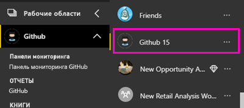

# Подключение к GitHub с помощью Power BI
В этой статье рассматривается извлечение данных из вашей учетной записи GitHub с помощью шаблона приложения Power BI. Приложение шаблон создает рабочую область с панели мониторинга, набор отчетов и набор данных, позволяют анализировать данные GitHub. В приложении GitHub для Power BI показывает ценные сведения о репозитории GitHub, а также называется репозитория, используя информацию о публикации, проблемы, запросы на включение внесенных изменений и активных пользователей.

После установки шаблона приложения, можно изменить панель мониторинга и отчетов. Затем можно распространять его как приложение коллегам в организации.

Подключение к [приложения шаблона GitHub](https://app.powerbi.com/getdata/services/github) или Узнайте больше о [интеграции GitHub](https://powerbi.microsoft.com/integrations/github) с помощью Power BI.

Можно также попытаться [руководстве GitHub](service-tutorial-connect-to-github.md). Он устанавливает реальными данными GitHub о из общедоступного репозитория для документации по Power BI.

>[!NOTE]
>Шаблон приложения требуется учетная запись GitHub для доступа к репозиторию. Дополнительные сведения о требованиях см. ниже.

## Способы подключения
[!INCLUDE [powerbi-service-apps-get-more-apps](./includes/powerbi-service-apps-get-more-apps.md)]
   
3. Выберите **GitHub** \> **получить сейчас**.
4. В **установить это приложение Power BI?** выберите **установить**.
4. В **приложений** области выберите **GitHub** плитку.

    

6. В **приступить к работе с нового приложения**выберите **подключайте данные из**.

    

5. Введите имя и владельца репозитория. Сведения о том, как найти необходимые параметры, см. [ниже](#FindingParams).
   
    

5. Введите учетные данные GitHub (этот шаг можно пропустить, если вы уже выполнили вход в браузере). 
6. В качестве **метода проверки подлинности** выберите **oAuth2** \> **Войти**. 
7. Следуйте инструкциям на экране. Предоставьте GitHub для Power BI разрешение приложения шаблона к данным GitHub.
   
   
   
    Power BI подключается к GitHub и данным.  Данные обновляются раз в день. После импорта данных в Power BI вы увидите содержимое новой рабочей областью GitHub.

## Изменение и распространение приложения

Вы установили приложение шаблона GitHub. Это означает, что вы также создали рабочую область приложения GitHub. В рабочей области можно изменить отчет и информационную панель и затем распространить его как *приложения* коллегам в организации. 

1. Щелкните стрелку рядом с именем рабочей области в панели навигации слева. Видно, что рабочая область содержит панель мониторинга и отчета.

    

8. Выберите новый [информационная панель GitHub](https://powerbi.microsoft.com/integrations/github).    
    

3. Чтобы просмотреть все содержимое новой рабочей областью GitHub, в панели навигации слева, выберите **рабочие области** > **GitHub**.
 
   

    Это представление является списке содержимого рабочей области. В правом верхнем углу, вы увидите **обновить приложение**. Когда вы будете готовы для распространения приложения, чтобы ваши коллеги, начнем именно это. 

    

2. Выберите **отчеты** и **наборы данных** для отображения элементов в рабочей области.

    Узнайте о [распространение приложений](service-create-distribute-apps.md) своим коллегам.

## Что входит в приложение
В GitHub для Power BI доступны следующие данные:     

| Имя таблицы | Описание |
| --- | --- |
| Активность |В таблице вкладов представлены общие дополнения, удаления и фиксации автора за неделю. Первые 100 участников включены. |
| Проблемы |Список всех проблем для выбранного репозитория и вычисления, например общее и среднее время закрытия проблемы, общее число открытых проблем и общее число закрытых проблем. При отсутствии проблем в репозитории эта таблица будет пустой. |
| Запросы на получение |В этой таблице содержатся все запросы на получение для репозитория и отправители запросов. Он также содержит вычисления, связанные сколько запросов на Вытягивание открытые, закрытые и общее, продолжительность запросы на Вытягивание и сколько времени заняло Средняя. При отсутствии проблем в репозиторий эта таблица будет пустой. |
| Пользователи |Эта таблица предоставляет список пользователей или участников, которые вносили свой вклад, заявляли о проблемах или обрабатывали запросы на получение для выбранного репозитория GitHub. |
| Вехи |Эта таблица содержит все вехи выбранного репозитория. |
| DateTable |Эта таблица содержит даты от сегодняшнего дня до лет в прошлом, позволяющие анализировать данные GitHub по дате. |
| ContributionPunchCard |Эту таблицу можно использовать как карточку отметки вкладов для выбранного репозитория. Здесь отображаются фиксации по дням недели и времени. Таблица не связана с другими таблицами в модели. |
| RepoDetails |Эта таблица содержит сведения о выбранном репозитории. |

## Требования к системе
* Учетная запись GitHub с доступом к репозиторию.  
* Разрешения, предоставленные приложению Power BI для GitHub во время первого входа в систему. Подробные сведения об отзыве доступа см. ниже.  
* Наличие достаточного числа вызовов API для извлечения и обновления данных.  

### Отмена авторизации Power BI
Для отмены авторизации Power BI к которому выполняется подключение к репозиторию GitHub, можно отозвать доступ в GitHub. См. в разделе, это [Справка по GitHub](https://help.github.com/articles/keeping-your-ssh-keys-and-application-access-tokens-safe/#reviewing-your-authorized-applications-oauth) сведения.

## Поиск параметров
Владельца и имя репозитория можно определить, просмотрев репозиторий на портале GitHub:

Первая часть, "Azure", — это владелец, а вторая часть, "azure-sdk-for-php", — это сам репозиторий.  Эти же два элемента можно увидеть в URL-адресе репозитория:

    <https://github.com/Azure/azure-sdk-for-php> .

## Устранение неполадок
При необходимости вы можете проверить учетные данные GitHub.  

1. В другом окне браузера перейдите на веб-сайт GitHub и войдите в GitHub. Состояние входа можно увидеть в правом верхнем углу сайта GitHub.    
2. На портале GitHub перейдите по URL-адресу репозитория, к которому вы планируете получать доступ к Power BI. Например: https://github.com/dotnet/corefx  
3. Вернувшись в Power BI, попытайтесь подключиться к GitHub. В диалоговом окне настройки GitHub укажите название репозитория и имя его владельца.  

## Дальнейшие действия

* [Руководство. Соединиться с репозиторием GitHub с помощью Power BI](service-tutorial-connect-to-github.md)
* [Создание новых рабочих областей в Power BI](service-create-the-new-workspaces.md)
* [Установка и использование приложений с информационными панелями и отчетами в Power BI](consumer/end-user-apps.md)
* [Подключение к приложениям Power BI для внешних служб](service-connect-to-services.md)
* У вас появились вопросы? [Попробуйте задать вопрос в сообществе Power BI.](http://community.powerbi.com/)

