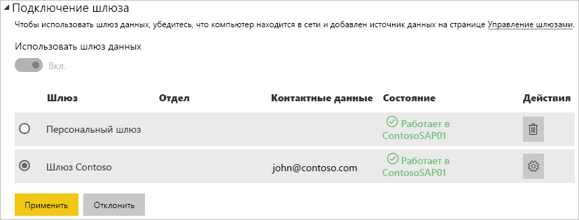

# Управление своим источником данных — SAP HANA

[!INCLUDE [gateway-rewrite](includes/gateway-rewrite.md)]

После [установки локального шлюза данных](/data-integration/gateway/service-gateway-install) нужно [добавить источники данных](service-gateway-data-sources.md#add-a-data-source), которые можно будет с ним использовать. В этой статье рассмотрены способы работы со шлюзами и источниками данных SAP HANA, которые используются для запланированного обновления или DirectQuery.

## Добавление источника данных

Дополнительные сведения о том, как добавить источник данных, см. в статье [Добавление источника данных](service-gateway-data-sources.md#add-a-data-source). В разделе **Тип источника данных** выберите **SAP HANA**.

Выбрав тип источника данных SAP HANA, укажите для него значения **Сервер**, **Имя пользователя** и **Пароль**.

> [!NOTE]
> Все запросы к источнику данных будут выполняться с использованием этих учетных данных. Дополнительные сведения о хранении учетных данных см. в статье [Хранение зашифрованных учетных данных в облаке](service-gateway-data-sources.md#store-encrypted-credentials-in-the-cloud).

После заполнения всех полей нажмите кнопку **Добавить**. Теперь этот источник данных можно использовать для запланированного обновления или для DirectQuery на сервере SAP HANA, расположенном на локальном компьютере. В случае успеха появится сообщение *Подключение установлено*.

### Дополнительные параметры

Для источника данных также можно настроить уровень конфиденциальности. Этот параметр определяет, каким образом можно комбинировать данные. Он используется только для запланированного обновления. Параметр уровня конфиденциальности не применяется к DirectQuery. Дополнительные сведения об уровнях конфиденциальности для источника данных см. в статье [Уровни конфиденциальности (Power Query)](https://support.office.com/article/Privacy-levels-Power-Query-CC3EDE4D-359E-4B28-BC72-9BEE7900B540).

## Использование источника данных

После создания источника данных он будет доступен для использования с подключениями DirectQuery или через функцию запланированного обновления.

> [!NOTE]
> Имена сервера и базы данных в Power BI Desktop и источнике данных в конфигурации локального шлюза должны совпадать.

Связь между набором и источником данных в пределах шлюза основана на именах сервера и базы данных. Эти имена должны совпадать. Например, если вы указали IP-адрес в качестве имени сервера в Power BI Desktop, необходимо будет использовать такой IP-адрес и для источника данных в конфигурации шлюза. Если вы используете формат *СЕРВЕР\ЭКЗЕМПЛЯР* в Power BI Desktop, нужно использовать тот же формат и в источнике данных, настроенном для шлюза.

Это требование справедливо и для DirectQuery, и для запланированного обновления.

### Использование источника данных с подключениями DirectQuery

Убедитесь, что имена сервера и базы данных совпадают в Power BI Desktop и источнике данных для шлюза. Кроме того, для публикации наборов данных DirectQuery ваша учетная запись должна быть указана на вкладке **Пользователи** источника данных. Выбор для DirectQuery выполняется в Power BI Desktop при импорте данных. Дополнительные сведения об использовании DirectQuery см. в статье [Использование DirectQuery в Power BI Desktop](desktop-use-directquery.md).

После публикации (из Power BI Desktop или окна **Получить данные**) ваши отчеты должны начать работать. Установление подключения после создания источника данных в рамках шлюза может занять несколько минут.

### Использование источника данных с запланированным обновлением

Если вы указаны на вкладке **Пользователи** источника данных, настроенного в шлюзе, а имена сервера и базы данных совпадают, вы увидите шлюз в списке вариантов, доступных для использования с запланированным обновлением.

## Дальнейшие действия

* [Устранение неполадок локального шлюза данных](/data-integration/gateway/service-gateway-tshoot)
* [Устранение неполадок со шлюзами — Power BI](service-gateway-onprem-tshoot.md) 

Появились дополнительные вопросы? Попробуйте задать вопрос в [сообществе Power BI](http://community.powerbi.com/).

