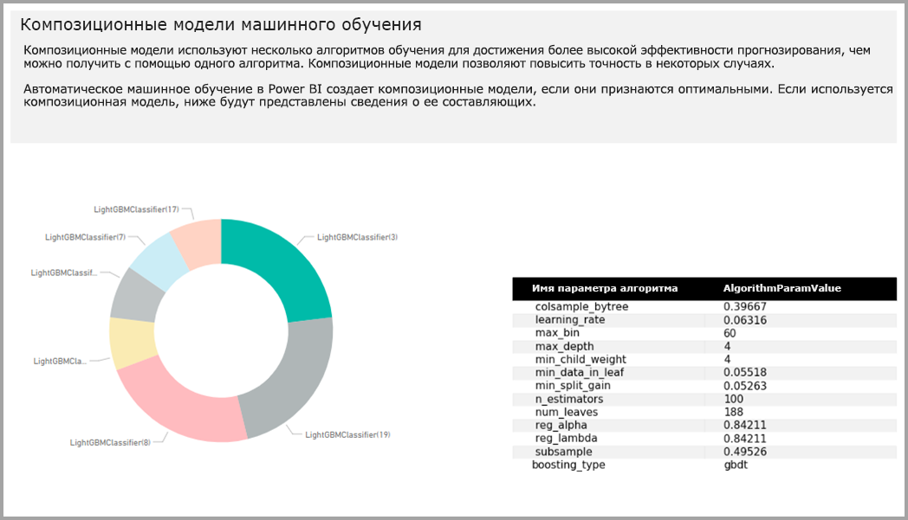
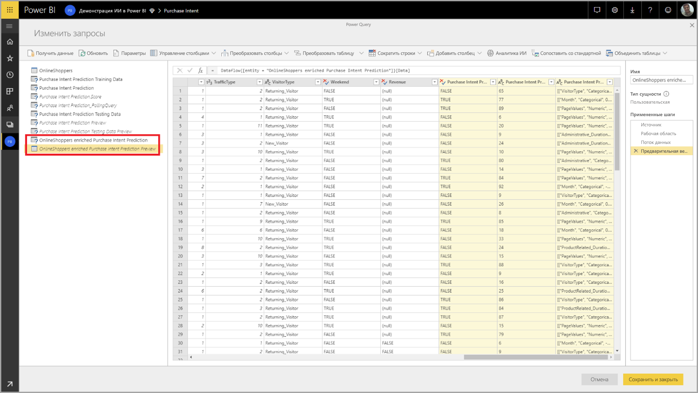
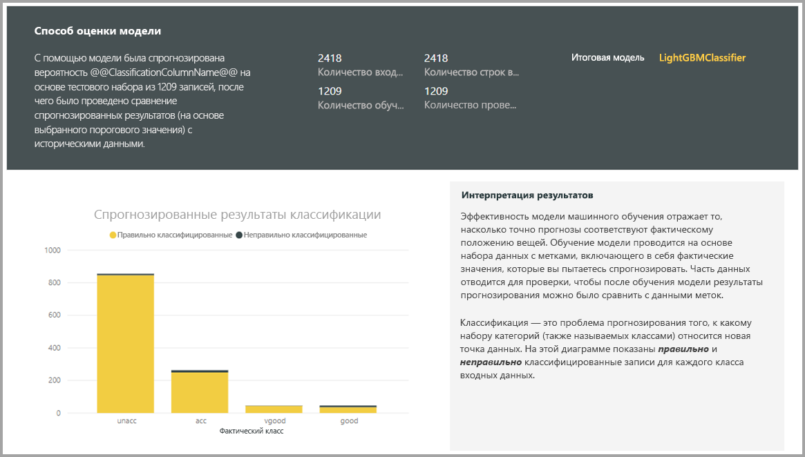
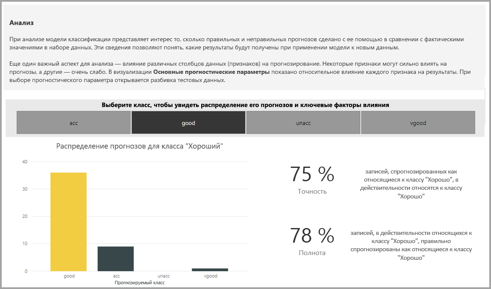

# Автоматизированное машинное обучение в Power BI (предварительная версия)

Автоматизированное машинное обучение (AutoML) для потоков данных позволяет бизнес-аналитикам обучать, проверять и вызывать модели машинного обучения непосредственно из Power BI. Эта служба предоставляет простой интерфейс для создания модели машинного обучения, в которой аналитики могут указывать потоки данных для указания входных данных для обучения модели. Служба автоматически извлекает наиболее релевантные компоненты, выбирает подходящий алгоритм, настраивает и проверяет модель машинного обучения. После обучения модели Power BI автоматически создает отчет с результатами проверки, которые предоставляют аналитикам сведения о производительности и результатах. Эту модель затем можно вызвать для любых новых или обновленных данных в потоке данных.

Автоматизированное машинное обучение доступно только для потоков данных, размещенных на емкостях Power BI Premium и Embedded. В этой предварительной версии AutoML позволяет обучать модели машинного обучения для моделей двоичных прогнозов, классификации и регрессии.

## Работа с AutoML

[Потоки данных Power BI](service-dataflows-overview.md) позволяют самостоятельно подготавливать наборы для больших данных. AutoML позволяет использовать процесс подготовки данных для создания моделей машинного обучения прямо в Power BI.

AutoML в Power BI позволяет аналитикам данных создавать модели машинного обучения на основе потоков данных, используя упрощенный интерфейс и навыки работы с Power BI. Большая часть действий по обработке и анализу данных, выполняемых для создания моделей машинного обучения, выполняется в Power BI автоматически с определенными ограничениями, которые должны гарантировать хорошее качество создаваемой модели и полную прозрачность процесса, используемого для создания модели машинного обучения.

AutoML поддерживает создание моделей **двоичного прогноза**, **классификации** и **регрессии** для потоков данных. Это контролируемые типы моделей машинного обучения, то есть они используют известные результаты прошлых наблюдений для прогнозирования результатов других наблюдений. Входной набор данных для обучения модели AutoML содержит набор записей **с информацией** об известных результатах.

AutoML в Power BI применяет [автоматизированное машинное обучение](https://docs.microsoft.com/azure/machine-learning/service/concept-automated-ml) из службы [Машинное обучение Azure](https://docs.microsoft.com/azure/machine-learning/service/overview-what-is-azure-ml) для создания моделей машинного обучения. Но для использования AutoML в Power BI не требуется подписка Azure. Процесс обучения и размещения моделей машинного обучения полностью управляется службой Power BI.

После обучения модели машинного обучения AutoML автоматически создает отчет Power BI с информацией о предполагаемой эффективности полученной модели машинного обучения. AutoML уделяет особое внимание объяснению причин, выделяя из входных данных ключевые факторы, влияющие на возвращаемые моделью прогнозы. Этот отчет также содержит ключевые метрики модели, которые будут разными в зависимости от типа модели.

На других страницах созданного отчета отображаются статистические сведения о модели и процессе обучения. Эта статистическая сводка будет интересна тем пользователям, которые предпочитают видеть меры эффективности модели, стандартно используемые в отрасли обработки и анализа данных. В сведениях об обучении собрана сводная информация по всем итерациям, которые выполнялись для создания модели, с указанием параметров моделирования. Здесь также описывается, как использовался каждый вход при создании модели машинного обучения.

После этого вы сможете применить модель машинного обучения к данным для ее оценки. При обновлении потока данных прогнозы, полученные из модели машинного обучения, автоматически применяются к данным. Power BI также предоставляет подробное объяснение для каждой конкретной оценки в прогнозах, которые создает модель машинного обучения.

## Создание модели машинного обучения

В этом разделе описывается, как создавать модель машинного обучения AutoML. 

### Подготовка данных для создания модели машинного обучения

Чтобы создать модель машинного обучения в Power BI, необходимо сначала создать поток данных с результатами предыдущих измерений для обучения модели машинного обучения. Сведения о настройке потока данных см. в руководстве по [самостоятельной подготовке данных в Power BI](service-dataflows-overview.md).

В текущем выпуске Power BI использует для обучения модели машинного обучения данные только из одной сущности. Таким образом, если исторические данные состоят из нескольких сущностей, вам следует вручную присоединить эти данные к одной сущности потока данных. Кроме того, есть смысл добавить вычисляемые столбцы для всех бизнес-метрик, которые могут быть надежными прогностическими факторами для прогнозируемого результата.

AutoML налагает определенные требования на данные для обучения модели машинного обучения. Эти требования описаны в разделах ниже для каждого типа моделей.

### Настройка входных данных для модели машинного обучения

Чтобы создать модель AutoML, щелкните значок машинного обучения в столбце **Действия** для сущности потока данных, который содержит исторические данные, и выберите действие **Добавить модель машинного обучения**.

Откроется несложный интерфейс мастера настройки, который поможет вам создать модель машинного обучения. Этот мастер содержит описанные ниже шаги.

1. Выбор сущности с данными об исторических результатах и поля, для которого требуется прогноз
2. Выбор типа модели на основе требуемого типа прогноза
3. Выбор входных данных, которые модель будет использовать в качестве прогнозных сигналов
4. Присвоение имени модели и сохранение конфигурации

Поле с историческими результатами определяет атрибут метки для обучения модели машинного обучения, как показано на следующем рисунке.

Когда вы выберете поле с историческими результатами, AutoML оценивает данные меток для выбора типов моделей машинного обучения, для обучения которых подходят эти данные, и предлагает наиболее подходящий тип модели машинного обучения. 

> [!NOTE]
> Бывает так, что некоторые типы моделей не поддерживаются для выбранных данных.

Также AutoML анализирует все поля в выбранной сущности, чтобы предложить входные данные для обучения модели машинного обучения. Этот процесс возвращает приблизительные результаты на основе статистического анализа, поэтому вам стоит проверить предложения по входным данным. Не следует использовать для обучения модели машинного обучения любые входные данные, которые зависят от поля исторических результатов (или от поля метки), так как это негативно влияет на эффективность модели.

На последнем шаге можно присвоить модели имя и сохранить ее параметры.

На этом этапе вам будет предложено обновить поток данных, что запустит процесс обучения модели машинного обучения.

### Обучение модели машинного обучения

Обучение моделей AutoML является частью процесса обновления потока данных. Сначала AutoML готовит данные для обучения.

AutoML разделяет предоставленные исторические на обучающие и проверочные наборы данных. Тестовый набор данных выполняет роль контрольного набора для проверки эффективности модели, которая выполняется после обучения. Эти наборы представлены в потоке данных в виде сущностей **обучения и тестирования**. AutoML использует перекрестную проверку для проверки модели.

Затем каждое поле ввода анализируется и отсутствующие значения заполняются вычисляемыми данными. AutoML использует несколько разных стратегий подстановки отсутствующих значений. После этого к данным применяются все необходимые методы выборки и нормализации.

AutoML применяет несколько преобразований для каждого выбранного входного поля, основываясь на типе данных и статистических свойствах этого поля. AutoML использует эти преобразования для извлечения компонентов, которые будут использоваться для обучения модели машинного обучения.

Процесс обучения для моделей AutoML состоит из нескольких итераций (до 50) с разными алгоритмами и параметрами моделирования, по итогам которых выбирается модель с лучшей эффективностью. Эффективность каждой из моделей оценивается путем проверки по набору контрольных данных. На этом этапе обучения AutoML создает несколько конвейеров для обучения и проверки этих итераций. Процесс оценки производительности моделей может занять от нескольких минут до нескольких часов в зависимости от размера набора данных и доступных ресурсов для выделенной емкости.

В некоторых случаях итоговая модель создается как ансамбль, в котором участвует сразу несколько моделей для повышения эффективности прогнозирования.

### Доступность моделей AutoML для объяснения

После обучения модели AutoML анализирует связи между компонентами входных данных и выходными данными модели. Для каждого компонента входных данных оценивается величина и направление изменений, которые он оказывает на выходные данные модели по контрольному набору данных. Это называется *важностью компонентов*.

### Отчет по модели AutoML

AutoML формирует отчет Power BI, в котором собраны сводные данные о производительности модели во время проверки, а также глобальные данные о важности компонентов. В отчете собираются результаты применения модели машинного обучения к контрольным (тестовым) данным, а результаты прогнозов сравниваются с известными значениями результата.

Отчет по модели позволяет оценить ее эффективность. По нему также можно убедиться, что ключевые факторы влияния в модели соответствуют существующей бизнес-аналитике по известным результатам.

Диаграммы и меры, которые используются в отчете для описания эффективности модели, зависят от типа модели. Эти диаграммы и меры производительности описаны в следующих разделах.

Дополнительные страницы в отчете могут описывать статистические меры по модели с точки зрения обработки и анализа данных. Например, отчет по **двоичному прогнозу** включает диаграмму выгоды и кривую ROC для модели.

Отчеты также содержат страницу **сведений об обучении**, на которой есть описание процесса обучения модели и диаграмма эффективности модели в каждой итерации.

Другой раздел на этой странице описывает, какой метод применялся для добавления отсутствующих значений в полях входных данных, а также методы преобразования каждого поля входных данных для извлечения компонентов, используемых в модели. Он также включает параметры, используемые в конечной модели.

Если созданная модель использует ансамбль обучения, то на странице **сведений об обучении** добавляется раздел, описывающий вес и параметры каждой модели в этом ансамбле.

## Применение модели AutoML

Если вас устраивает эффективность созданной модели машинного обучения, вы можете применить ее к новым или обновленным данным при обновлении потока данных. Это можно сделать прямо из отчета о модели, нажав кнопку **Применить** в правом верхнем углу.

Чтобы применить модель машинного обучения, необходимо указать имя сущности, к которой она будет применена, и префикс для столбцов, которые будут добавлены в эту сущность для выходных данных модели. По умолчанию префиксом для имен столбцов назначается имя модели. Функция *Применить* может принимать дополнительные параметры в зависимости от типа модели.

Применение модели машинного обучения создает новую сущность потока данных с суффиксом **enriched <имя_модели>**. Например, если вы примените модель _PurchaseIntent_ к сущности _OnlineShoppers_, на выходе будет сформирована сущность **OnlineShoppers enriched PurchaseIntent**.

В настоящее время выходная сущность нельзя использовать для просмотра результатов модели машинного обучения в редакторе Power Query. Выходные столбцы всегда содержат значение NULL в качестве результата. При применения модели создается вторая выходная сущность с суффиксом **enriched <имя_модели> Preview**, предназначенная для просмотра результатов.

Чтобы просмотреть результаты в редакторе запросов, обновите поток данных.

После применения модели AutoML всегда поддерживает актуальность прогнозов при обновлении потока данных.

Также AutoML предоставляет контекстное объяснение для каждой строки, которая оценивается в выходной сущности.

Чтобы использовать аналитические сведения и прогнозы из модели ML в отчете Power BI, подключитесь к выходной сущности из Power BI Desktop с помощью соединителя **потоков данных**.

## Модели двоичного прогнозирования

Модели двоичного прогнозирования, официально именуемые **моделями двоичной классификации**, используются для классификации набора данных в две группы. Они используются для прогнозирования событий с двумя возможными исходами, например: будет ли конвертирована возможность для продажи, уйдет ли клиент, будет ли счет своевременно оплачен, является ли транзакция мошеннической.

Такой результат является двоичным, поэтому Power BI ожидает для модели двоичного прогнозирования в качестве метки логическое значение, которое обозначает возможные исходы как **true** и **false**. Например, в модели конвертации возможных сделок реализованные возможности помечаются как true, потерянные обозначаются как false, а еще не закрытые возможности продаж имеют значение NULL.

Выходные данные модели двоичного прогнозирования содержат оценку вероятности, то есть долю уверенности в том, что будет достигнут результат, соответствующий значению метки true.

### Обучение модели двоичного прогнозирования

Чтобы создать модель двоичного прогнозирования, нужно предоставить входную сущность с обучающими данными, где существует логическое поле с историческими результатами, то есть с данными об уже известных событиях.

Предварительные требования.

* Логическое поле в качестве поля исторических результатов
* Для каждого возможного исхода нужно предоставить не менее 50 строк исторических данных.

Если уже известные результаты идентифицируются по полям с другим типом данных, обычно нетрудно добавить вычисляемый столбец для преобразования этих полей в логическое значение с помощью Power Query.

Процесс создания модели двоичного прогнозирования содержит те же шаги, что и для других моделей AutoML, как описано выше в разделе **Настройка входных данных для модели машинного обучения**.

### Отчет о модели двоичного прогнозирования

Модель двоичного прогнозирования возвращает в качестве выходных данных оценку вероятности того, что для этой записи будет получен результат, обозначенный логическим значением true для метки. Отчет содержит срез по порогу вероятностей, который влияет на интерпретацию оценок выше и ниже порога вероятности.

Эффективность модели в этом отчете оценивается по категориям *истинные положительные результаты*, *ложные положительные результаты*, *истинные отрицательные результаты* и *ложные отрицательные результаты*. Истинные положительные и истинные отрицательные результаты — это правильно спрогнозированные исходы по двум классам. Ложные положительные результаты — это те, которые фактически имеют метку с логическим значением false, но в прогнозе получили значение true. Ложные отрицательные результаты — это те, которые фактически имеют метку с логическим значением true, но в прогнозе получили значение false.

Дополнительные меры, такие как точность и полнота, описывают влияние значения порога на прогнозируемые результаты. Изменяя срез порога вероятности, вы можете выбрать такое пороговое значение, при котором достигается сбалансированный компромисс между точностью и полнотой.

Страница **отчета о точности** в отчете о модели содержит диаграмму *совокупного прироста* и кривую ROC для модели. Это статистические меры эффективности модели. В отчетах есть описания отображаемых диаграмм.

### Применение модели двоичного прогнозирования

Чтобы применить модель двоичного прогнозирования, необходимо указать сущность с данными, к которым вы хотите применить прогнозы по модели машинного обучения. Укажите такие параметры, как префикс имени для выходного столбца и порог вероятности для классификации прогнозируемого результата.

При применении модели двоичного прогнозирования она добавляет в расширенную выходную сущность три выходных столбца. Они именуются **PredictionScore**, **PredictionOutcome** и **PredictionExplanation**. Имена столбцов в сущности дополняются префиксом, который вы указали при применении модели.

Столбец **PredictionOutcome** содержит прогнозируемую метку исхода. Для записей, для которых вероятность превышает пороговое значение, прогнозируется достижение успешного результата, а для всех с меньшим значением прогнозируется неблагоприятный исход.

Столбец **PredictionExplanation** содержит объяснение того, какое конкретное влияние оказали входные компоненты на оценку **PredictionScore**. Это коллекция весовых коэффициентов входных функций для прогноза, сохраненная в формате JSON.

## Модели классификации

Модели классификации используются для распределения набора данных в несколько групп или классов.  Они используются для прогнозирования событий, которые могут иметь один из нескольких возможных результатов, например: очень высокая, высокая, средняя или низкая ценность клиента за время его существования; высокий, средний, низкий или очень низкий уровень риска невыплат.

Выходные данные модели классификации содержат оценку вероятности, то есть прогнозируемая уверенность в том, что для записи будут выполняться критерии определенного класса.

### Обучение модели классификации

Для модели классификации нужно предоставить входную сущность с обучающими данными, где существует строковое или числовое поле с историческими результатами, то есть с данными об уже известных событиях.

Предварительные требования.

* Для каждого возможного исхода нужно предоставить не менее 50 строк исторических данных.

Процесс создания модели классификации содержит те же шаги, что и для других моделей AutoML, как описано выше в разделе **Настройка входных данных для модели машинного обучения**.

### Отчет о модели классификации

Отчет о модели классификации создается путем применения модели машинного обучения к контрольным (тестовым) данным и сравнения прогнозируемых результатов с фактическим значением для каждой записи.

Отчет о модели содержит диаграмму с разбивкой по правильным и неправильным результатам классификации для каждого известного класса.

Более подробный анализ для каждого класса позволяет узнать, как распределялись прогнозы по каждому известному классу. В том числе указываются другие классы, в которые ошибочно относились записи конкретного класса.

Описание модели в отчете также включает самые важные прогностические факторы для каждого класса.

Отчет по модели классификации также содержит страницу с подробными сведениями о обучении, как и для других типов моделей, как описано в разделе **Отчет по модели AutoML** выше в этой статье.

### Применение модели классификации

Чтобы применить модель классификации машинного обучения, нужно указать сущность со входными данными и префикс для имени выходного столбца.

При применении модели классификации она добавляет в расширенную выходную сущность три выходных столбца. Они именуются **PredictionScore**, **PredictionClass** и **PredictionExplanation**. Имена столбцов в сущности дополняются префиксом, который вы указали при применении модели.

Столбец **PredictionClass** содержит наиболее вероятный прогнозируемый класс для записи. Столбец **PredictionScore** содержит список с оценками вероятности для каждого возможного класса по этой записи.

Столбец **PredictionExplanation** содержит объяснение того, какое конкретное влияние оказали входные компоненты на оценку **PredictionScore**. Это коллекция весовых коэффициентов входных функций для прогноза, сохраненная в формате JSON.

## Модели регрессии

Модели регрессии используются для прогнозирования определенного значения, например: доход от продажи, ценность клиента за все время существования, оплаченная сумма по счету, дата оплаты счета.

Результатом модели регрессии является прогнозируемое значение.

### Обучение модели регрессии

Для модели регрессии нужно предоставить входную сущность с обучающими данными, где существует числовое поле с историческими результатами, то есть с уже известными значениями.

Предварительные требования.

* Для модели регрессии нужно предоставить не менее 100 строк исторических данных.

Процесс создания модели регрессии содержит те же шаги, что и для других моделей AutoML, как описано выше в разделе **Настройка входных данных для модели машинного обучения**.

### Отчет по модели регрессии

Как и в отчетах по другим моделям AutoML, отчет по модели регрессии основан на результатах применения модели к контрольным (тестовым) данным.

Отчет по модели содержит диаграмму, где прогнозируемые значения сравниваются с фактическими значениями. На этой диаграмме отклонение от диагонали означает ошибку в прогнозе.

На диаграмме "остаточная ошибка" представлено распределение доли среднего отклонения для разных значений в контрольном наборе данных. По горизонтальной оси откладывается среднее фактическое значение для группы, а размер пузырька обозначает частоту или число значений в этом диапазоне. По вертикальной оси отмечается средняя остаточная ошибка.

Отчет по модели регрессии также содержит страницу с подробными сведениями о обучении, как и для других типов моделей, как описано выше в разделе **Отчет по модели AutoML**.

### Применение модели регрессии

Чтобы применить модель регрессии машинного обучения, нужно указать сущность со входными данными и префикс для имени выходного столбца.

При применении модели регрессии она добавляет в расширенную выходную сущность два выходных столбца. Они именуются **PredictionScore** и **PredictionExplanation**. Имена столбцов в сущности дополняются префиксом, который вы указали при применении модели.

Столбец **PredictionValue** содержит прогнозируемое для записи значение, основанное на входных данных. Столбец **PredictionExplanation** содержит объяснение того, какое конкретное влияние оказали входные компоненты на оценку **PredictionValue**. Это коллекция весовых коэффициентов входных функций, сохраненная в формате JSON.

## Дальнейшие действия

В этой статье кратко описывается интеграция автоматизированного машинного обучения с потоками данных в службу Power BI. Следующие статьи также содержат полезные сведения на эти темы.

* [Руководство. Создание модели машинного обучения в Power BI (предварительная версия)](service-tutorial-build-machine-learning-model.md)
* [Руководство. Использование служб Cognitive Services в Power BI](service-tutorial-use-cognitive-services.md)
* [Руководство. Вызов модели Студии машинного обучения в Power BI (предварительная версия)](service-tutorial-invoke-machine-learning-model.md)
* [Использование Cognitive Services в Power BI (предварительная версия)](service-cognitive-services.md)
* [Интеграция Машинного обучения Azure в Power BI (предварительная версия)](service-machine-learning-integration.md)

См. дополнительные сведения о потоках данных в следующих статьях:
* [Creating and using dataflows in Power BI (Preview)](service-dataflows-create-use.md) (Создание и использование потоков данных в Power BI (предварительная версия))
* [Использование вычисляемых сущностей в Power BI Premium](service-dataflows-computed-entities-premium.md)
* [Использование потоков данных с локальными источниками данных](service-dataflows-on-premises-gateways.md)
* [Ресурсы для разработчиков потоков данных Power BI](service-dataflows-developer-resources.md)
* [Потоки данных и интеграция Azure Data Lake (предварительная версия)](service-dataflows-azure-data-lake-integration.md)

