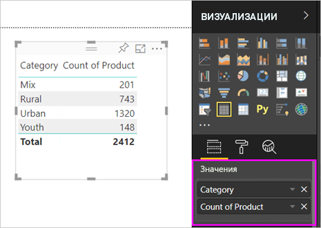
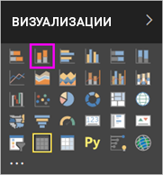
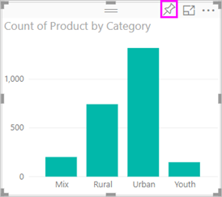

# Часть 1. Добавление визуализаций в отчет Power BI

В этой статье содержатся краткие вводные сведения о создании визуализации в отчете. Эта информация относится к службе Power BI и к Power BI Desktop. Дополнительные сведения см. в [части 2](power-bi-report-add-visualizations-ii.md) этой серии. В этом видео Аманда покажет вам несколько разных способов создания, изменения и форматирования визуальных элементов на холсте отчетов. Теперь попробуйте сделать это сами, использовав раздел [Продажи и маркетинг — пример](../sample-datasets.md) для создания собственного отчета.

<iframe width="560" height="315" src="https://www.youtube.com/embed/IkJda4O7oGs" frameborder="0" allowfullscreen></iframe>

## Открытие отчета и добавление новой страницы

1. Откройте [отчет в режиме правки](../service-interact-with-a-report-in-editing-view.md).

    В этом руководстве используется [образец "Продажи и маркетинг"](../sample-datasets.md).

1. Если панель **Поля** не отображается, щелкните значок со стрелкой, чтобы ее открыть.

   

1. Добавьте пустую страницу в отчет.

## Добавление визуализаций к отчету

1. Создайте визуализацию, выбрав поле на панели **Поля** .

    Начните с числового поля, например **Факт продажи** > **Продажи в долл. США**. Power BI создаст гистограмму с одним столбцом.

    

    Начните с поля категории, например **Имя** или **Продукт**. Создайте в Power BI таблицу и добавьте поле в область **Значения**.

    

    Кроме того, можно начать с поля для географических данных, такого как **Геообъект** > **Город**. Создание визуализации карты при помощи Power BI и Карт Bing.

    

1. Создайте визуализацию и измените ее тип. Выберите **Продукт** > **Категория**, а затем **Продукт** > **Число продуктов**, чтобы добавить эти поля в раздел **Значения**.

   

1. Измените визуализацию на гистограмму, выбрав значок **Гистограмма с накоплением**.

   

1. Созданные в отчете визуализации можно [закреплять на панели мониторинга](../service-dashboard-pin-tile-from-report.md). Чтобы закрепить визуализацию, выберите значок закрепления .

   
  
## Дальнейшие действия

 Дальнейшие действия

* [Часть 2. Добавление визуализаций в отчет Power BI](power-bi-report-add-visualizations-ii.md)

* [Взаимодействовать с визуализациями](../consumer/end-user-reading-view.md) в отчете.

* [Выполнять дополнительные действия с визуализациями](power-bi-report-visualizations.md).

* [Сохранить отчет](../service-report-save.md).
